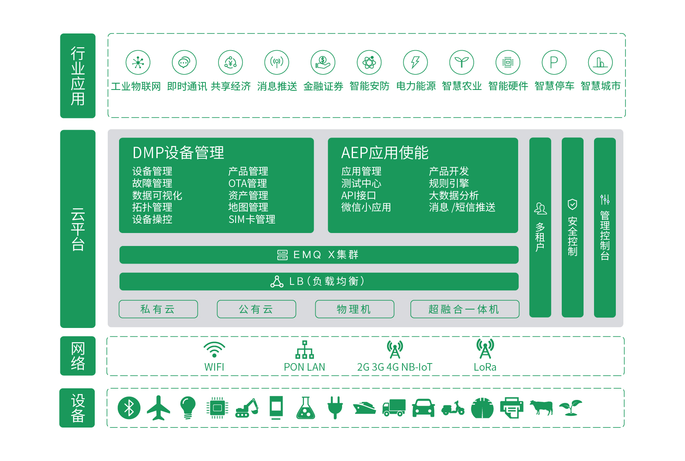

# ActorCloud 使用手册

**ActorCloud** 是一个面向低功耗IoT网络，为企业提供一站式平台服务的物联网平台。**ActorCloud** 在安全可靠的基础上，为设备提供多种协议接入的通信能力，设备数据与消息流管理功能。

平台提供基础设备管理功能以连接、管理海量设备，实现设备的消息通信与数据采集持久化；集成规则引擎与数据可视化管理，灵活开放多种权限级别的管理、控制 API，通过 API 可快速开发上层应用，实现多端接入、设备远程控制。

- IoT Hub：为终端上云建立可靠双向连接通道，进行认证鉴权、协议解析与消息路由；
- 设备管理：终端注册开通与生命周期管理，提供状态、故障、流量的不间断监控；
- 数据引擎：对获取的终端消息高速持久化、实时解析、规则事务处理与可视化展示；
- 应用使能：提供终端SDK、APP SDK，开放丰富的 REST API 接口，集成消息推送接口。

访问 [https://www.actorcloud.io](https://www.actorcloud.io/) 可试用 **ActorCloud** 完整功能。

### 接入准备

  - 一台能够访问公共网络的计算机；

  - 如果您已经有物理设备，则可以使用设备接入 **ActorCloud** 来完成本教程；

  - 如果您没有物理设备，可以通过使用 [MQTT 客户端](https://developer.emqx.io/sdk_tools?category=MQTT_Clients)或[在线测试中心](https://console.actorcloud.io/mqtt_client)利用软件环境来模拟一个接入设备，查看[设备接入指南](./access_guide/device.md)。

    

### 接入方式

尽管同一账户下任意接入方式中的设备消息是互通的，但是您需要依据产品需求选择合适的接入方式。

通常使用 SSL/TLS 在带来更高的安全性的同时会降低连接性能，一些设备性能受限只能运行轻量级的 CoAP 客户端，而 WebSocket 则被推荐用于浏览器上实时通信。

##### 附：**ActorCloud** 支持接入协议

| 名称  | 接入地址 | 使用说明 |
| ------- | ------- | ----|
| MQTT  | iot.actorcloud.io:1883 | 普通 MQTT 接入 |
| MQTT/SSL  | iot.actorcloud.io:8883 | SSL MQTT 接入（单向认证） |
| MQTT/SSL  | iot.actorcloud.io:8884 | SSL MQTT 接入 （双向认证）|
| CoAP  | iot.actorcloud.io:5683/mqtt | MQTT/CoAP 接入 |
| CoAP/DTLS  | iot.actorcloud.io:5684/mqtt | DTLS MQTT/CoAP 接入 |
| MQTT/WebSocket  | iot.actorcloud.io:8083/mqtt | MQTT/WebSocket 接入 |
| MQTT/WebSocket/SSL  | iot.actorcloud.io:8084/mqtt | SSL MQTT/WebSocket 接入 |
| 私有 TCP协议透传 | 需定制 | 私有 TCP协议透传 |

