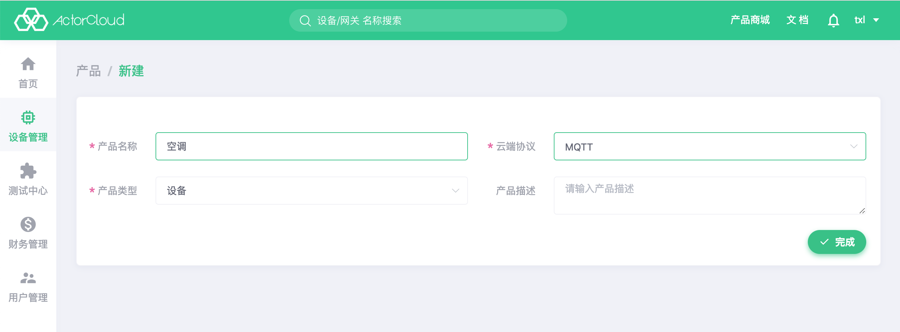
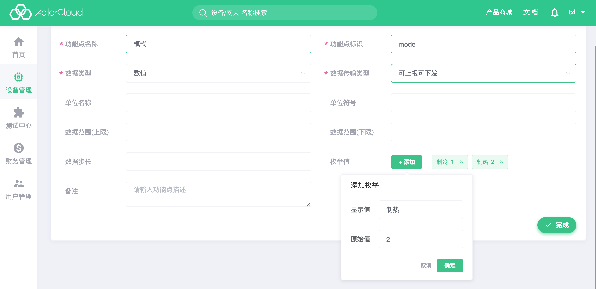
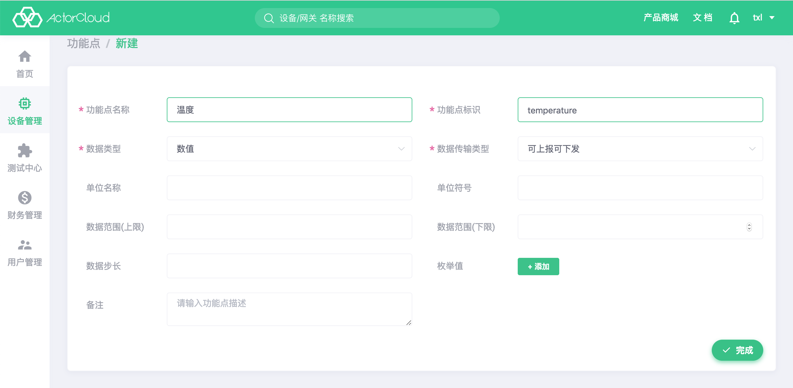
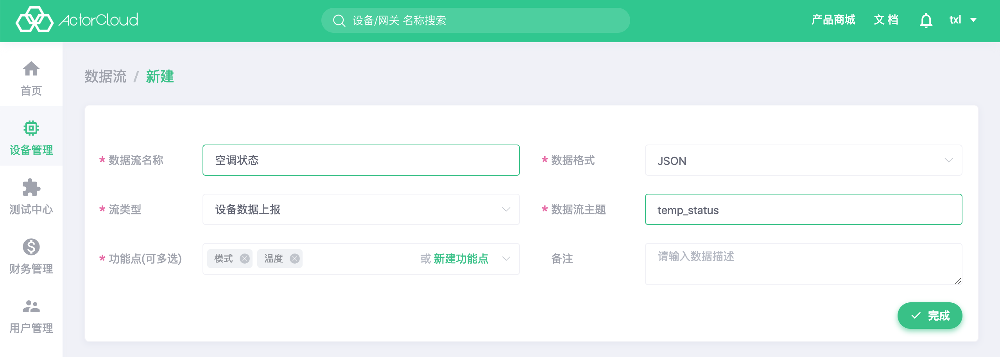
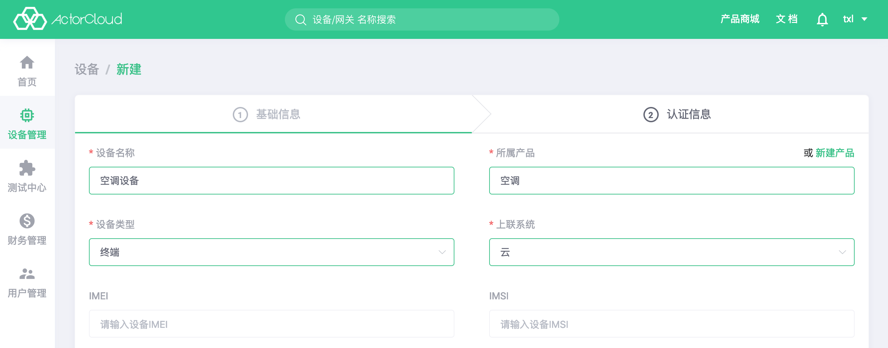
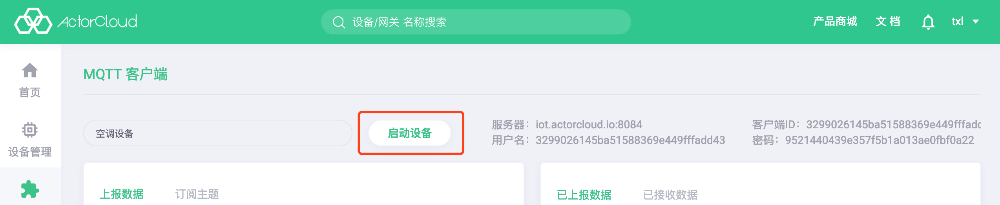
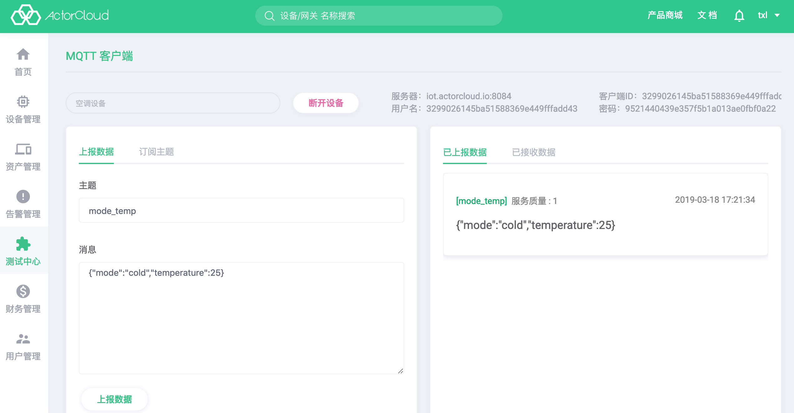

# 快速接入指南

设备快速接入指南将通过实例，指导开发者使用actorcloud将设备快速接入MQTT，完成数据上报基本操作。

## 案例概述

本案例通过空调上报温度和模式（制冷，制热）给MQTT为例，帮助开发者快速体验接入MQTT。

## 接入步骤

1. #### 新建产品

   选择 设备管理->产品管理->新建，创建一个名为"**空调**"的产品，云端协议选择"**MQTT**"，产品类型选择"**设备**"，点击"完成"，添加设备成功。

   

   新建产品详细操作请参考[创建产品](/device/product_create.md)。

2. #### 新建功能点

   选择 设备管理-> 产品管理，产品列表页找到上一步创建的产品“**空调**”，点击名称，进入产品详情页面，选择“**功能点**”选项卡，点击右上角“新建”。

   创建一个功能点“**模式**”，输入功能点标识（必填，不可重复）“**mode**”，数据类型选择“**数值**”，数据传输类型选择“**可上报可下发**”，枚举值添加“**制冷**”“**制热**”两个值，点击“完成”，新建功能点成功。

   

   再创建一个功能点“**温度**”，输入功能点标识“**temperature**”，数据类型选择“**数值**”，数据传输类型选择“**可上报可下发**”，点击“完成”，新建功能点成功。

   

   功能点详细介绍请参考[功能点](/device/product.md#功能点)。

3. #### 新建数据流

   选择“**数据流**”选项卡，点击右上角“新建”。

   数据流名称填入“**空调状态**”，数据格式选择“**JSON**”，流类型选择“**设备数据上报**”，数据流主题填入“**temp_status**”，功能点选择上一步创建好的两个功能点“**模式**”“**温度**”，点击完成，成功添加数据流。

   

   数据流详细介绍请参考[数据流](/device/product.md#数据流)。

4. #### 新建设备

   选择 设备管理->新建，新建一个名为"**空调设备**"的设备，所属产品选择第一步创建的产品"**空调**"，设备类型选择"**终端**"，上联系统选择"**云**"，点击"下一步"，认证信息页面点击"完成"，添加设备成功。

   

   新建设备详细操作请参考[创建设备](/device/device_create.md)。

5. #### 上报数据

   选择 测试中心->MQTT客户端，选择上一步创建好的设备“**空调设备**”，点击启动设备，接入mqtt。

   

   在“上报数据”选项卡，输入上面创建的数据流主题“**temp_status**”，消息字段输入JSON数据“**{mode:1,temperature:25}**”（制冷25度），点击“上报数据”，上报成功，右侧“已上报数据”选项卡可看到上报数据。

   

   MQTT客户端详细操作请参考[MQTT客户端](/test_center/mqtt.md#mqtt-客户端)。

   