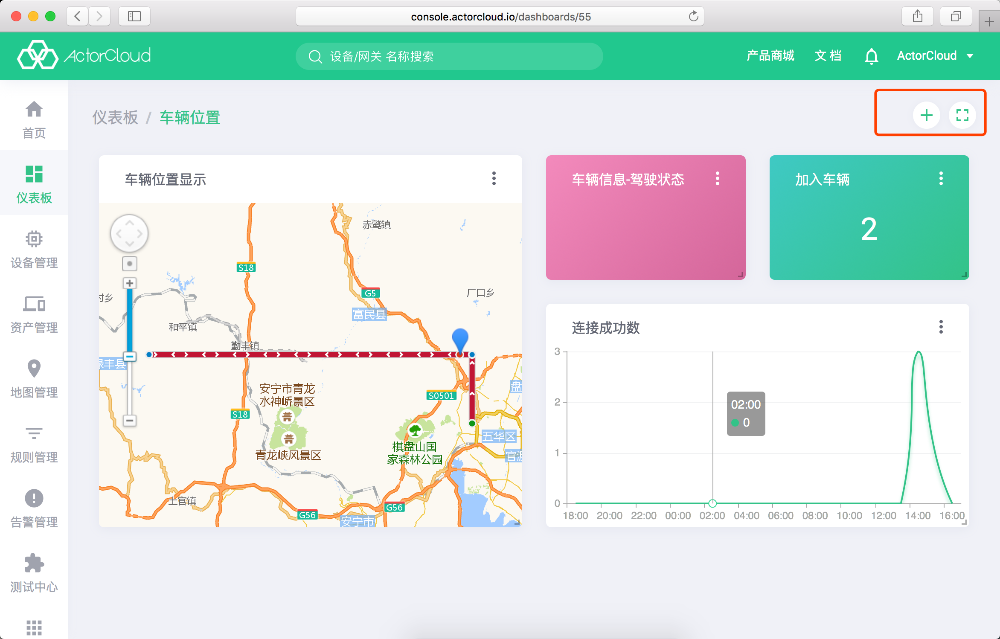
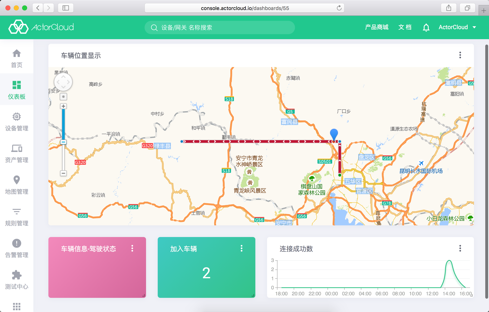

# 仪表盘

仪表盘支持各类数据、多种形式的图表、地图等定义与展示，仪表盘服务需要在商城 **设备管理平台 DMP** 开通 **仪表盘** 服务。

依次点击左侧菜单 **仪表盘** -> **仪表盘** 进入仪表盘列表页，点击右上角新建可以创建一个仪表盘。

仪表盘详情中可以查看当前仪表盘仪表卡片，点击右上角**添加卡片**可以为当前仪表盘添加一个图标卡片。

仪表盘可以包含任意设备、分组、产品等数据指标图表，每个图表可以拖拽改变位置、点击右下角拖放改变图表尺寸。

