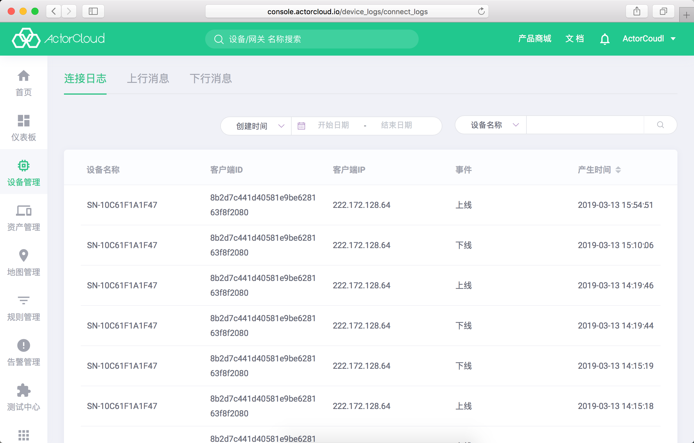
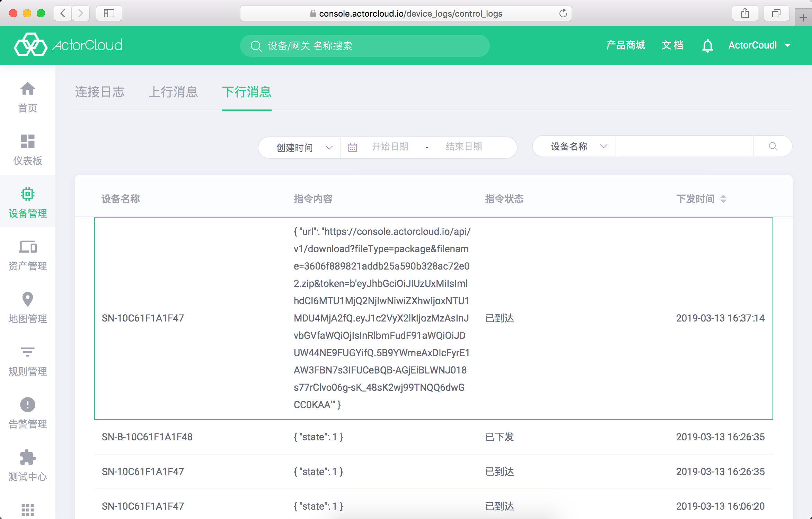

# 设备日志

依次点击左侧导航栏**设备管理** -> **设备日志**可查看设备日志信息。设备日志包含**连接日志**、**上行消息**、**下行消息**。

### 连接日志

- 连接日志记录账户下设备的连接情况，包含连接时间、客户端 ID， 客户端 IP ，认证情况等信息；

- 进入设备管理->设备日志页面，点击**连接日志**标签页，可查看连接日志：

- 在设备详情页**设备信息**标签页中，可以查看具体设备基本信息及运行日志：
              

### 下行消息

- 下行消息是 **ActorCloud** 向设备下发消息记录，包含指令内容、指令状态等信息；

- "指令状态"包含已下发/已到达状态，通过查询该状态可以确认指令是否抵达设备；

- 进入设备管理->设备日志页面，点击**下行消息**标签页，可查看下行消息：

- 在设备详情页**设备控制**标签页中可以查看具体设备下行消息记录：
