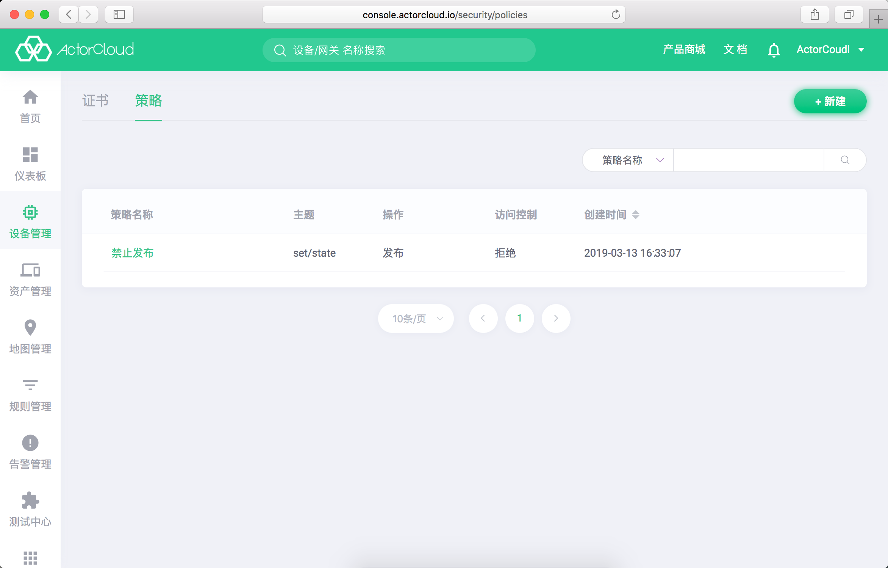

# 策略管理

业务中如有更加精细的设备发布，订阅权限控制需要，用户可在 **ActorCloud** 创建相关策略进行事件控制。

策略提供主题级别的权限控制，依次点击**设备管理** -> **安全管理** -> **策略** 可进行策略的管理。

## 策略创建

- 输入策略名称，作用主题与控制操作、访问规则可以创建证书，其中主题需满足 MQTT 主题规则。

## 绑定设备

- 策略详情页中提供新增设备绑定、已绑定设备列表进行相关规则管理，符合规则的设备将被阻止或允许触发相关事件。
