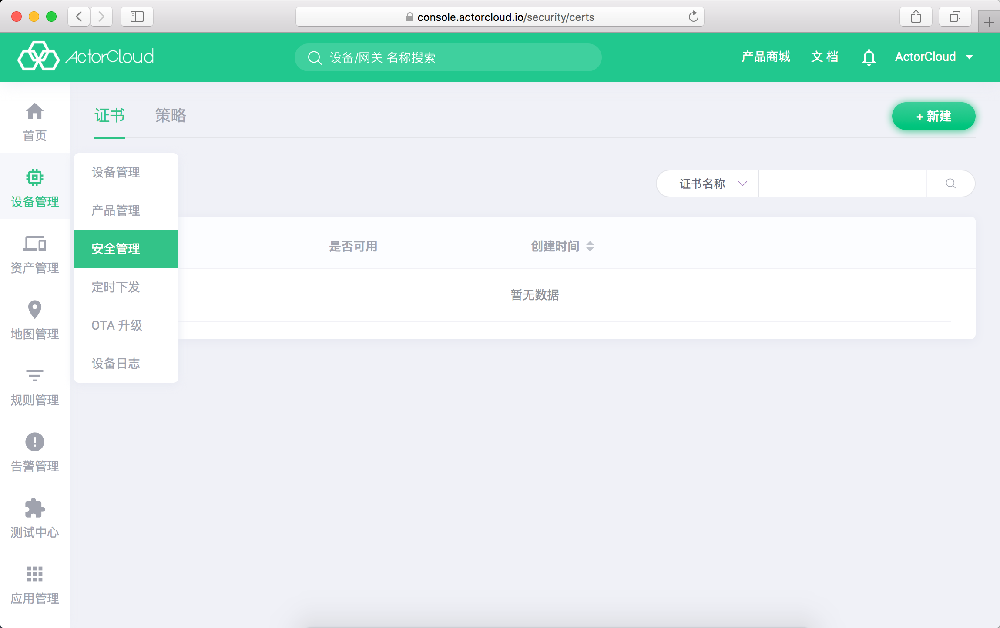

# 安全管理

**ActorCloud** 提供多种维度的接入与通信安全管理：

证书接入：

- 1. 接入安全等级较低时，为兼顾设备接入性能可以可以使用Token 认证在接入阶段进行认证，使用非加密的 TCP 连接通信；
- 2. 接入安全等级较高时，在 1 的基础上可以使用 SSL/TLS 加密通信，保障数据传输阶段中的安全；
- 3. 使用证书双向认证，将平台创建的证书绑定并烧录进设备可以提供高级别的安全保障（平台上设备认证方式需为“证书”）。

策略控制：

平台支持设备发布、订阅 ACL 权限管理，对设备行为做出约束管理。

依次点击 **设备管理** -> **安全管理** 可进入证书与策略管理页：

- [证书管理](./certs.md)

- [策略管理](./policy.md)

