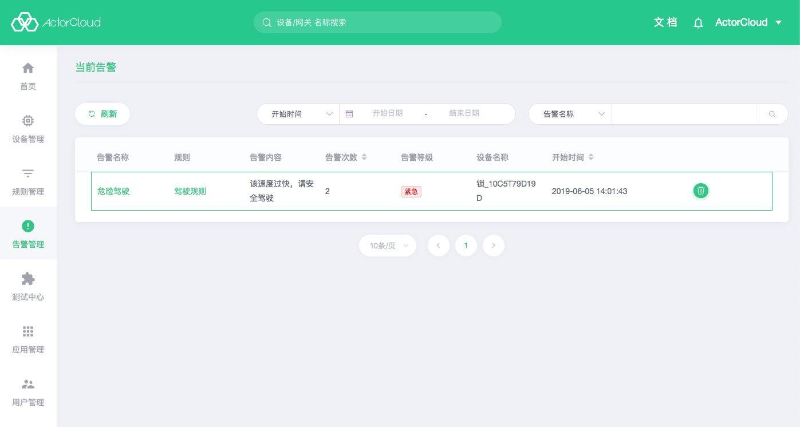

# Alert Management

The trigger action information  with the action type of **Alarm** in the [business rule](/rule_engine/business_rules.md) or [scope rule](/rule_engine/scope_rules.md) will be recorded in the alert management.

### Current alert

Currently triggered and persistent alert information includes alert content, number of alerts, and alert level. It is supported to filter and search by alert name, device name, and alert level. When the same rule is triggered continuously, the number of alerts will be accumulated. When the new arrival message alert no longer exists, the record will be automatically moved to the historical alert. Click the delete button to permanently delete the record.

### Historical alert

For the same rule, if the new arrival message no longer triggers the alert, the corresponding information in the current alert  will be moved to the **historical alert**.

The historical alert contains information such as the number of alerts, start time, and end time. It is supported to filter and search by start/end time interval, alert name and device name. Click the delete button to permanently delete the record.