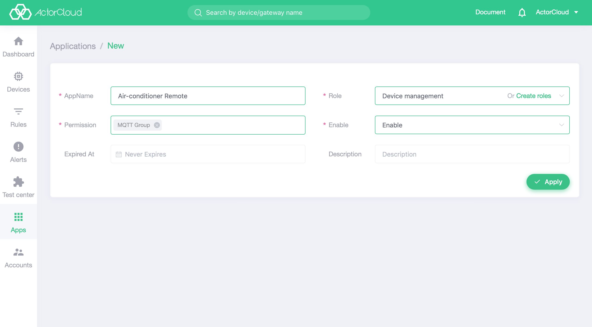

# Application List

**ActorCloud** provides  [REST API](/rest/rest.md)  interface for device management.

Go to the **Application Management->Applications List** page, click **New** to create a new API Credential, and invoke the Platform API via **App ID** and **Application Key**.

### Points for attention

- The permissions of application must be assigned through the application role, and the new application needs to be associated with the relevant role;
- The  group permissions of application must be specified , and the  REST API interface called by application can  only manage  related resources under its group (such as devices)  within the role permissions

> **Application Key** can be viewed on the details page of **Applications** . Please keep the application information in a safe place and destroy the expired key in time.

# Application role

The permissions of application must be assigned through the application role, and the new application needs to be associated with the relevant role.  **ActorCloud** provides three levels of roles by default:

- Device management: support to view, create, edit, delete, control devices, without management permissions of product, group, log, certificate ;
- Data display: only view information such as devices, products, group, certificates, logs;
- Super App: All the APIs provided by the platform can be called.

The default role does not allow modification, and new manual selection can be done if more subtle role control is required.

