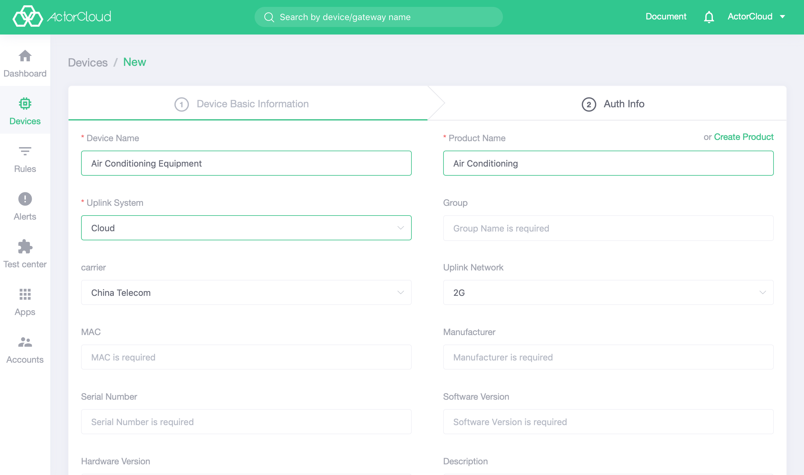
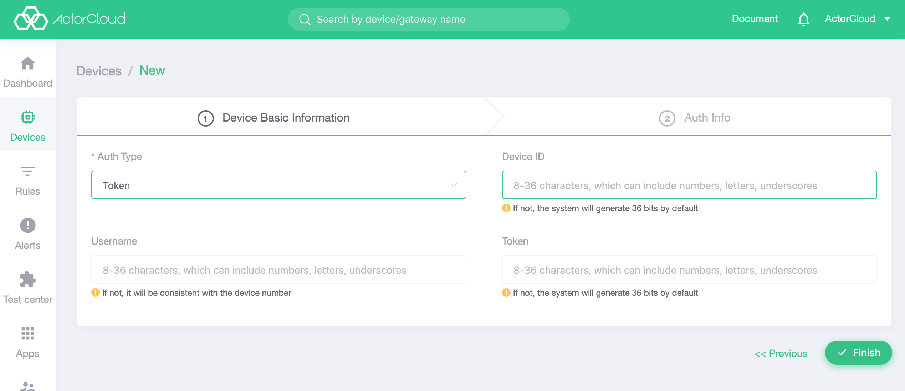

# Create device

### Device registration 

In the device  list page, click the **New ** button in the upper right corner to perform the device creation operation. The device must correspond to a product. Before creating a new device, the product to which the device belongs need to be created.

The device information includes basic information and authentication information. The **device number**, **connected user name**, and **device key** in the authentication information are filled in according to the specified rules, and cannot be changed once filled out.

### The difference between authentication methods:

- Token: Use **device number** and **username** **password** to connect, support normal TCP or SSL/TLS one-way authentication;
- Certificate: Requires the device binding certificate and uses two-way authentication to connect. After the certificate is selected, the device can be authenticated by carrying the certificate information without a username and password.

> If the authentication information is not filled in, the system will generate 36-bit characters by default. It is suggested that the field is left blank to be generated automatically by the system.
