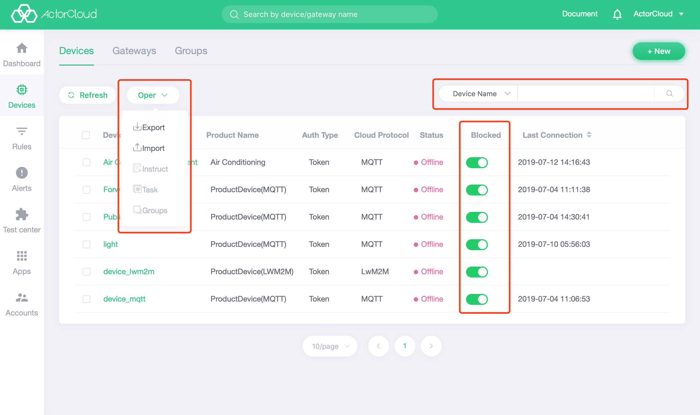

# Device list

The device list is used to display a collection of devices that have been created. After a single row of devices is selected, this page allows for more device operations:

- Batch export: Export platform devices to Excel files without having to select devices. Click **Batch Export** on the device list page to export all devices.
- Batch import: Import device information using an Excel template file;
- Command issue: the command is issued to the selected device;
- Task configuration: configure timing task of the selected device ;
- Create a group: Create a group from the selected device;

