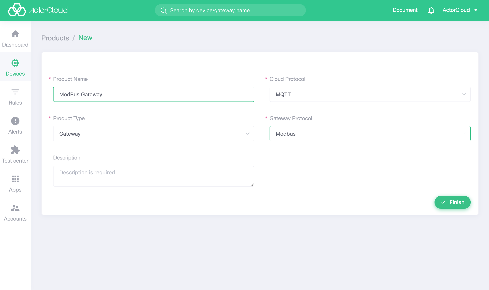

# Gateway management

Special devices in **ActorCloud** that converge device messages and connect to servers can be called gateways, such as base stations in LoRa protocol and operators'  transparent interfaces in NB-IoT protocol.

Click the **Device Management** -> **Gateway ** tab to manage the access gateway. Click on the list page name to enter the gateway information page, which includes 5 pages of **Gateway Information, Device Management, connection log ,  gateway event , device data**.  Its function and display information are as follows.

To facilitate management  and statistics, if the uplink system of device is the gateway, the corresponding gateway need to be created and select  when the device is newly created.

### Gateway information

The basic gateway information is displayed that is the same with device information. Three modules  of basic information, authentication information and location information are displayed. Gateway information has one more gateway protocol than device information. The gateway of MQTT transparent protocol can be connected to **ActorCloud** by gateway number, gateway user name and gateway key.

### Device management

When the uplink system of the device is a gateway and the current gateway is selected, a device can be bound to the gateway. The list is the device that is bound to the gateway. The list operation is the same as the device list.

### Connection log

The connection log of gateway  is the same as the connection log of the device, that is the online or offline information of the gateway.

### Gateway events

The message reported by the gateway is displayed in real time, which is similar to the device event function.

### Device data

Displays the latest data for the gateway device.
