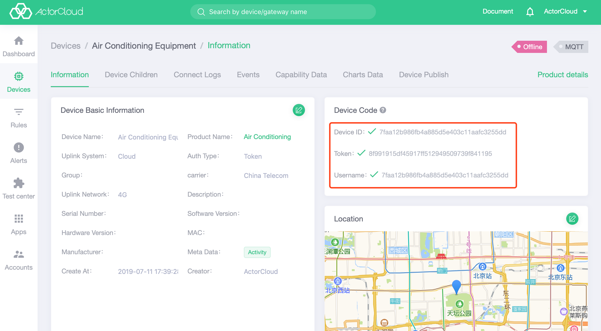
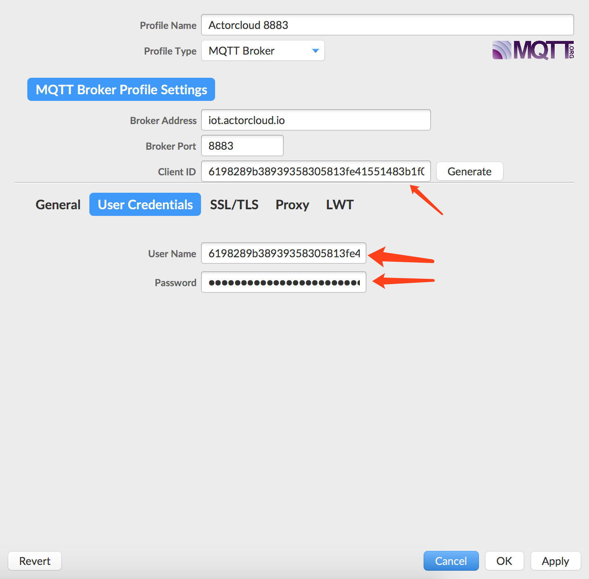
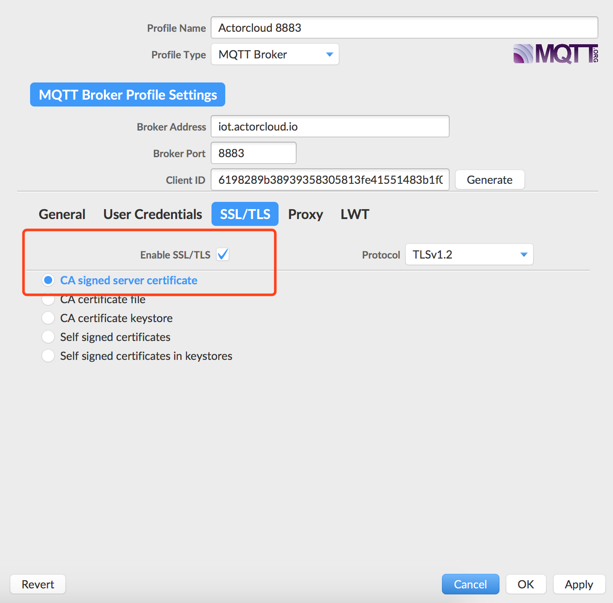

# One-way authentication

Use the 8883 port for SSL/TLS encrypted communication:

- Dvice uses the device number, device key, and connection user name for authentication.
- Device authentication method is Token
- Device access address is: `iot.acotecloud.io:8883`

Use the device number, device key, and connection username to connect to the message server:

- Device number: When the device is connected to the MQTT server, client_id is the device number;
- Device key: Correspond to  MQTT connection password when the device is connected;
- Connection username: Correspond to MQTT connection username when the device is connected.

The device authentication information can be viewed on the device authentication information module:



Sample access code:

```python
# --coding: utf-8--

import ssl
import paho.mqtt.client as mqtt
import json

# Device needs to be registered on the ActorCloud platform
client_id = '6198289b38939358305813fe41551483b1f0'
username = '6198289b38939358305813fe41551483b1f0'
password = '2312686198f5722ef570b855694655f1b475'
HOST = 'iot.actorcloud.io'
PORT = 8883


def on_connect(client, userdata, flags, rc):
    print('Connected with result code ' + str(rc))
    client.subscribe('/hello')
    client.publish('/hello', json.dumps({
        'hello': 'world'
    }))


# The message published by device or other ways is unified processed here.
def on_message(client, userdata, msg):
    print('topic: {0}, payload: {1}'.format(msg.topic, str(msg.payload)))
    # Other processing logic
    pass

client = mqtt.Client(client_id=client_id)

# One-way authentication still requires a username and password
client.username_pw_set(username, password)

# Set Certificate Information
client.tls_set(certfile=None, keyfile=None, cert_reqs=ssl.CERT_REQUIRED, ciphers=None)
client.on_connect = on_connect
client.on_message = on_message

client.connect(HOST, PORT)

client.loop_forever()

```

If  the MQTT fx test is used, the connection settings are as follows:

- Set the basic access information according to the information provided on the **Device Security** page, and use the 8883 port to specify the certificate SSL/TLS encryption method.




