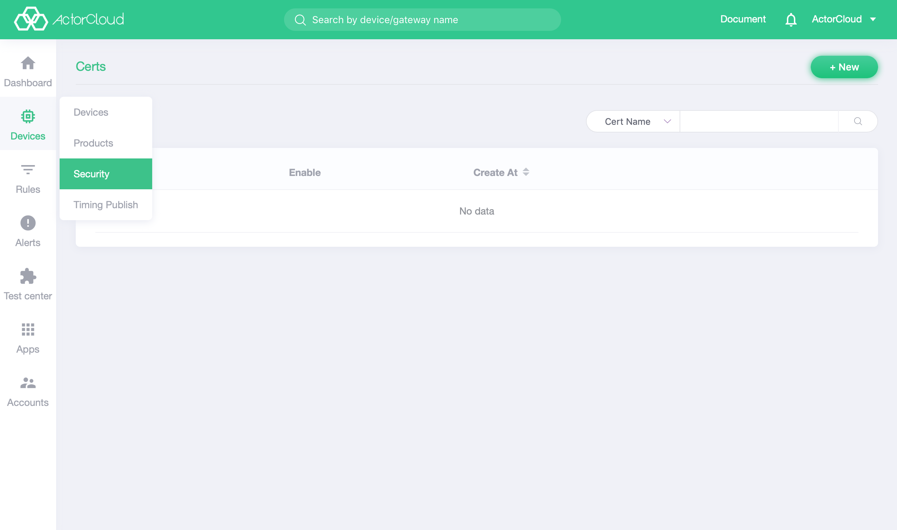

# Security management

**ActorCloud** provides multiple dimensions of access and communication security management:

Certificate access:

1. When the access security level is low, Token authentication can be used to authenticate in the access phase and non-encrypted TCP connection can be used to communicate with the device access performance.
2. When the access security level is high, SSL/TLS encryption communication can be used on the basis of 1 to ensure security in the data transmission phase;
3. Use certificate two-way authentication to bind and burn the certificate created by the platform into the device to provide a high level of security (the device authentication mode on the platform must be “certificate”).

For the method of creating a certificate, refer to [Certificate Management](./certs.md)

