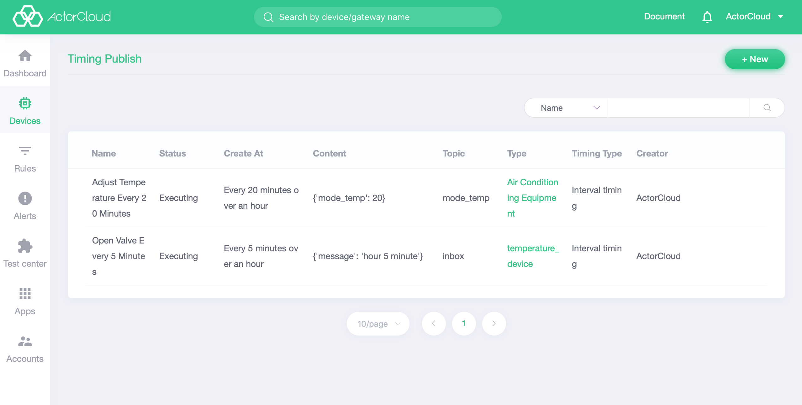

# Timing publish

Click the **Device Management** -> **Timing publish** tab to display the timing publish record of all devices on the platform. The timing task is to send a message to the device periodically or regularly. All devices can add timing tasks. The timing publish mode is supported by all platforms. The timing published information such as the time, content, and topic of the device can be viewed by the list. The task name and timing type can also be filtered in the list.

Click New in the upper right corner and select a device to create a timing publish command. The publish mode is divided into fixed timing and interval timing. In the fixed timing method, the command is published after specified time. In the interval timing method, the command can be published when the interval is repeated. The interval is  the fixed time of hourly, daily, and weekly. The data format of the publish content is `JSON`.

