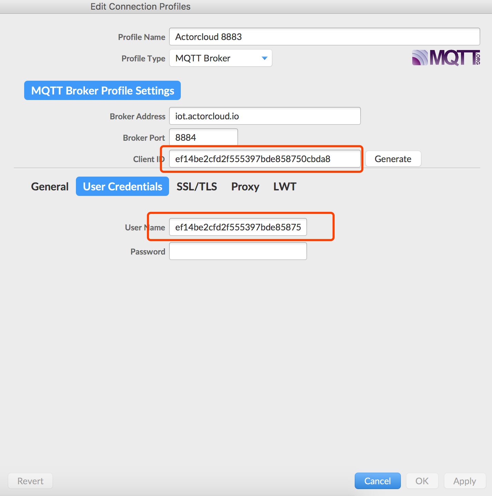
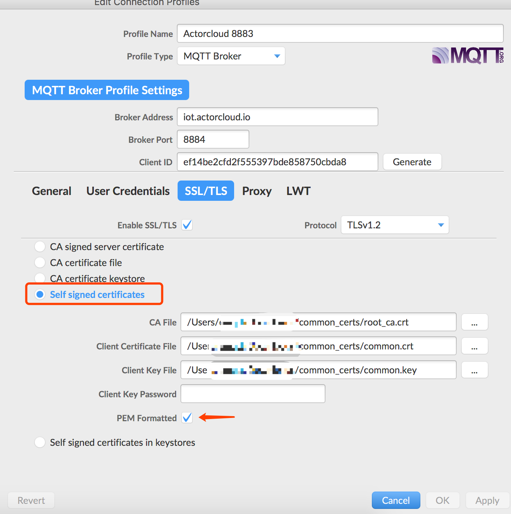

# Two-way authentication

Use the 8884 port for SSL/TLS communication, the server device uses the bundled certificate to verify the device identity:

- Need to use **device number **and **connect username** 
- Device authentication method is certificate
- Use the certificate of device  bounded by the platform 
- The device access address is: `iot.acotecloud.io:8884`

On the details page of the corresponding certificate bounded by the device, click to download the certificate and extract the file to get:

```bash
common_certs/
├── common.crt # Self-signed certificate;
├── common.key # Self-signed certificate key
└── root_ca.crt  # ActorCloud root certificate;
```

The device that uses two-way authentication does not require password authentication, but it  needs to bind and use matching certificates to authenticate successfully.

Sample code:

```python
# --coding: utf-8--

import ssl
import paho.mqtt.client as mqtt
import json

# Device needs to be registered on the ActorCloud platform and the authentication method is "Certificate"
client_id = 'ef14be2cfd2f555397bde858750cbda8'
username = 'ef14be2cfd2f555397bde858750cbda8'
password = '630a7f6b54d75e50a2e59b4baca722d4'
HOST = 'iot.actorcloud.io'

#Two-way authentication port
PORT = 8884


def on_connect(client, userdata, flags, rc):
    print('Connected with result code ' + str(rc))
    client.subscribe('/hello')
    client.publish('/hello', json.dumps({
        'hello': 'world'
    }))


# Messages published by device, group control and other methods are processed here.
def on_message(client, userdata, msg):
    print('topic: {0}, payload: {1}'.format(msg.topic, str(msg.payload)))
    # Other processing logic
    pass

client = mqtt.Client(client_id=client_id)
# Two-way authentication only requires the use of a username
client.username_pw_set(username)
# Set PROT to 8884 and set the root certificate, signature certificate and key path

client.tls_set(ca_certs='./common_certs/root_ca.crt',
	certfile='./common_certs/common.crt',
	keyfile='./common_certs/common.key',
	tls_version=ssl.PROTOCOL_TLSv1_2)

client.tls_insecure_set(True)

client.on_connect = on_connect
client.on_message = on_message

client.connect(HOST, PORT)

client.loop_forever()
```


If the MQTT fx test is used, the connection settings are as follows:

- To set the basic access information according to the information provided on the **Device Security** page, the Client ID and User Name need to be specified , and  the 8884 port is used to specify the certificate SSL/TLS encryption mode and set the self-signed certificate path:




