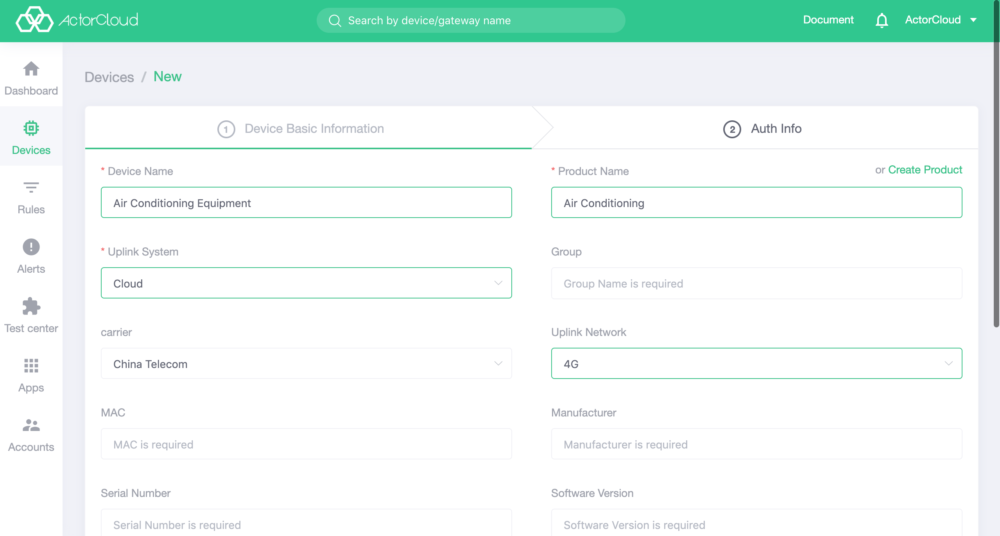
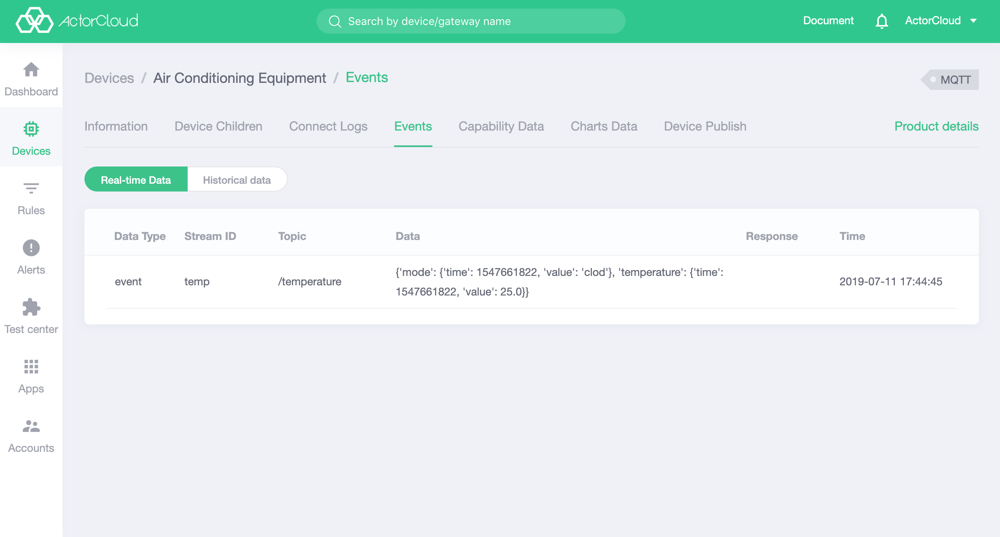

# Quick access guide

The device quick access guide will teach developers how to quickly connect MQTT protocol devices to the ActorCloud platform and complete analog data reporting.

### Example overview

This example takes air conditioning reporting temperature and mode (cooling, heating) data as an example to help developers quickly access MQTT protocol devices.

### Access step

#### 1. Create product

Select Device Management -> Product Management -> New, create a product called **Air Conditioning** , select **MQTT** for the cloud protocol, select **Device** for the product type, and click **Finish** . The product is added successfully.

For details on how to create a new product, please refer to [Create Product](/products/product_create.md).

#### 2. Create data stream

Select the **Feature Definition** tab and click **New** in the upper right corner.

The name of data stream is filled in  **air conditioning status**, the data stream identifier is filled in **temp**, which is the ID of the data stream, and the stream type is selected as **Device data reporting**, the data stream topic is filled in **mode_temp** and the comment is optional.   

For details on the data flow, please refer to [Data Flow](/products/product.md#data-stream).

#### 3. Create data point

Select Device Management -> Product Management, find the product Air Conditioning created in the previous step from Product List page. Click on the name, enter the product details page, select the **Function Definition** tab, and display a data stream list. Click on the arrow at the top of the line of the data stream created just now to expand the row and display a sub-list, which is a list of the data points to which the data stream is bound.   

Create a data point, click on the **add data point** in the sub-list, a new data point can be created or data points that have been created before can be selected. Here, we choose to create a new data point. the name of data point name is **Mode**, input data point identifier (the ID of the data point that is required and non-repeatable) **mode**,  select **string** or data type , select **Both be reported or be published** for data transmission type , click **Save**, then the new data point is created successfully.

In the same way, we create a data point **temperature**, input data point identifier  **temperature**,  select **value** for data type, select **Both be reported or be published** for data transmission type , click **Save**, then the new data point is created successfully.

For details on the data points, please refer to [data point](/products/product.md#data-point).

#### 4. Create device

Under the product, select the **Device Management** tab and create a new device named **Air Conditioning Equipment**. The belonged product is selected as **Air Conditioning** created in the first step. Select **Cloud** as the uplink system, click **Next Step**, and click **Finish** on the authentication information page. The device is added successfully.

For details on how to create a new device, see [Creating Device](/devices/device_create.md).

#### 5. Analog device to report data

Select Test Center -> MQTT Client, select the device **Air Conditioning Device** created in the previous step, click Launch Device to analog the device access to ActorCloud.

In the topic of the **Report Data** tab, enter the data flow topic **mode_temp** created above and enter JSON data based on the initial template. Click **Report Data** and the data is reported successfully, which can be viewed  on the right side of the **Reported Data** tab.

    {
      "data_type": "event",
      "stream_id": "temp",
      "data": {
        "temperature": {
          "time": 1547661822,
          "value": 25
        },
        "mode": {
          "time": 1547661822,
          "value": "clod"
        }
      }
    }

For details on the MQTT client, please refer to [MQTT Client](/test_center/mqtt.md).

#### 6. View data reported by device

Device event: Enter device management, find the device **air conditioner** created above, click the device name to enter the device details page, select the **Event** tab, the user can see the data information just reported, and view the real-time data and historical data. Device events are detailed in [Events](/devices/device.html#events).

Capability data: Select the **Capability Data** tab, the user can see the parsed report data, and can also view real-time data and historical data. Refer to [Capability Data](/device/device.html#功能数据) for detailed capability data.

