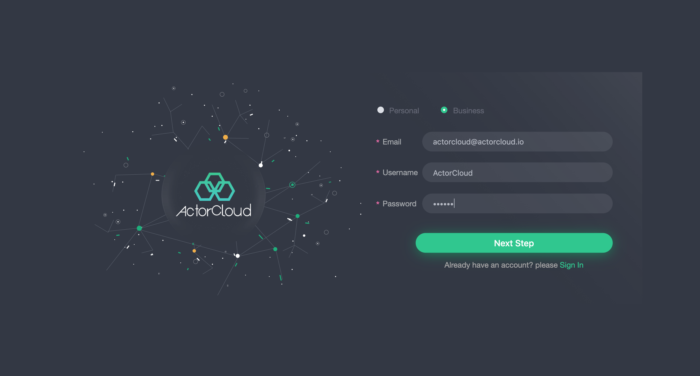
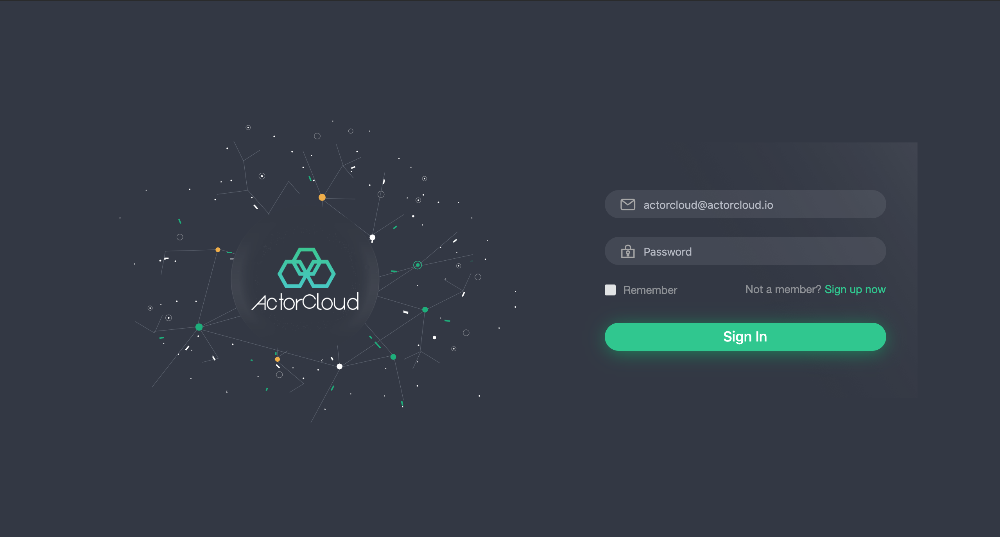
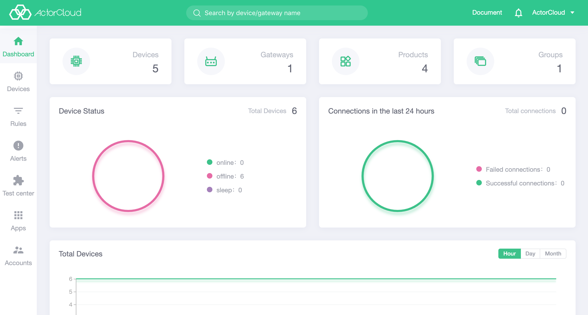
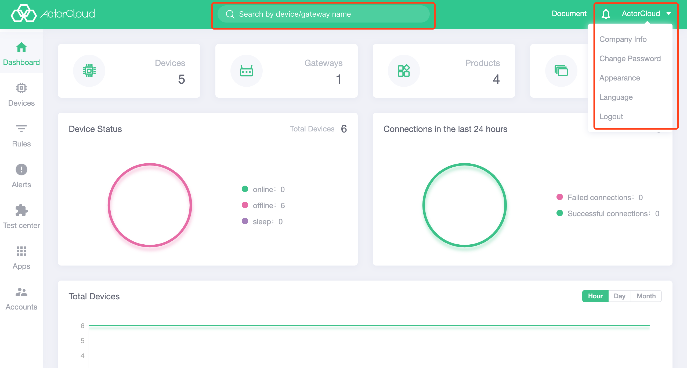

# Quick start

### Register an ActorCloud Account

1. Open [ActorCloud demo Homepage](https://demo.actorcloud.io/) , if the platform has not been logged in before or the login information has expired, it will jump to the login page;

2. Click [Go to Register](https://demo.actorcloud.io/signup) to complete the registration information and create a brand new account based on the user's identity;

3. After successfully creating the account, it will jump to the login page, and the account email and password can be used to log in the system;

4. The user can use [user invitation](/users/users.md#user-invitation) function to directly send the invitation link to the specified mailbox for registration.

> If the user enters the registration page via the invitation link, the page no longer provides an account type selection.

### Log on to ActorCloud Platform

- Log in using the email and password of the registered account.

##### Differences between Individual Users and Enterprise Users

- Individual users use a single account to manage the platform, and the account has all operating rights of the platform,  which is suitable for single-person management;

- Enterprise users have platform management authority control, and they can create multiple enterprise sub-accounts directly or through email invitation, and give appropriate permissions for platform management.

### Data overview

Click the **Homepage** on the left navigation bar to view the current account overview information, click on  **device number ,  gateway number ,  product quantity ,  group number** on the top , and it can jump to the relevant list page to view the data. In addition, this page provides device connection and message data statistics for multiple aspects as follows:

- Current device online status: statistics of online, offline and dormancy of the device under the account;
- Recent 24-hour connection status: statistics of connection success and failure;
- Total number of devices: line chart statistics of total equipment;
- Message count: line chart statistics for the times of device login, publish, receive, subscribe, unsubscribe ;
- Traffic statistics: line chart statistics for the traffic of device login, publish, receive, subscribe, unsubscribe.

### Top menu bar operation

#### Global quick search

- Enter a name in the global search box to quickly search for devices and gateways that are targeted to the response.

#### Account information change

- Click the user name of the currently logged user in the upper right corner to open the account information change option, and click **Company Information** to perform the **Company Information** (Company Account) modification operation, and upload the company logo to strengthen the brand image.

#### Change Password

- Click the user name of the currently logged user in the upper right corner to open the account information change option, and click **Change Password** to perform the **Change Password** operation.

#### Switch theme

- Alight theme and a dark theme are provided by the platform management interface , and click here to switch the display style.

#### Switch language

- Chinese and English are provided by the platform management, and click to quickly switch languages.
