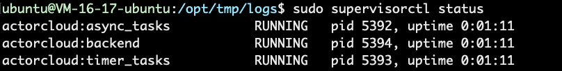

# Single node deployment

* This document describes how to deploy ActorCloud on a single Linux node

* It is recommended ActorCloud Rule Engine and Server are deployed on different machines

* ActorCloud is deployed by default in the `/opt` directory

  

## Installation

### Preparation before installation

#### Basic environment configuration

```bash
$ sudo apt-get update
$ sudo apt-get -y install wget gcc curl
```

#### Get the ActorCloud installation package
Go to  ActorCloud [releases](https://github.com/actorcloud/ActorCloud/releases) to get the latest version

```bash
# Change the directory permissions for the ActorCloud project (optional, default /opt directory)
$ sudo chown -R ubuntu:ubuntu /opt
# Get Actorcloud-*-*.tar.gz or Actorcloud-*-*.zip in assets 
$ wget https://github.com/actorcloud/ActorCloud/releases/download/v3.0.0-rc.3/ActorCloud-v3.0.0-rc.3.tar.gz
# Unzip
$ tar -zxvf ActorCloud-v3.0.0-rc.3.tar.gz -C /opt
```

### Third-party component installation

#### TimescaleDB
[TimescaleDB installation](timescaledb.md#timescaledb-安装)

#### EMQ X
[EMQ X installation](emqx.md#emq-x-安装)


### ActorCloud codec Installation (optional)

ActorCloud Codec needs to work with EMQ X of Enterprise Edition 

#### Docker Engine Installation

```bash
$ curl -fsSL https://get.docker.com | sh
```

#### Get ActorCloud codec image

```bash
$ docker pull actorcloudcli/actorcloud-codec
```

#### Run ActorCloud codec

```bash
$ docker run -it -d --restart=always --name actorcloud-codec \
         -p 7002:7002 actorcloudcli/actorcloud-codec
```

### ActorCloud Rule Engine Installation

#### Basic environment configuration

```bash
$ sudo apt install openjdk-8-jdk
```

#### Pulsar Installation
Pulsar can be installed by downloading the binary installation package.

```bash
# Get apache pulsar 2.2.0 installation package
$ wget https://archive.apache.org/dist/pulsar/pulsar-2.2.0/apache-pulsar-2.2.0-bin.tar.gz
# Unzip (default /opt directory)
$ tar -zxvf apache-pulsar-2.2.0-bin.tar.gz -C /opt
# Rename
$ mv /opt/apache-pulsar-2.2.0 /opt/pulsar
```

#### Rule Engine Installation
Rule Engine run files are stored in the path of `/opt/actorcloud/deploy/rule_engine` 

```bash
$ cp -r /opt/actorcloud/deploy/rule_engine /opt/pulsar
```

### ActorCloud Server Installation

#### Basic environment configuration

1. Python3.6 Installation

    ```bash
    $ sudo add-apt-repository -y ppa:jonathonf/python-3.6
    
    $ sudo apt-get update
    
    $ sudo apt-get install -y python3.6
    
    $ sudo apt-get install -y python3.6-dev
    ```

2. Pip Installation

   ```bash
   $ wget https://bootstrap.pypa.io/get-pip.py && python3.6 get-pip.py --force-reinstall --user
   ```

3. Pipenv Installation

   ```bash
   $ pip install --user pipenv
   ```

4. Supervisord Installation

   ```bash
   $ sudo apt-get install -y supervisor
   ```

5. Nginx Installation

   ```bash
   $ sudo apt-get install nginx
   ```

#### Create the virtualenv 

Installation needs to be performed in the path of `/opt/actorcloud/server/` 
```bash
$ pipenv install --skip-lock
```


## Configuration

### Third-party component configuration

#### TimescaleDB
[TimescaleDB configuration](timescaledb.md#timescaledb-配置)

#### EMQ X
[EMQ X configuration](emqx.md#emq-x-配置)

### ActorCloud Rule Engine configuration

The Rule Engine configuration file is in the path of `/opt/pulsar/rule_engine` 

#### actorcloud-db-sink-config.yml
Database connection information modification

```YAML
configs:
  userName: root
  password: public
  jdbcUrl: jdbc:postgresql://127.0.0.1:5432/actorcloud
  tableName: device_events
  columns:
    - topic
    - msgTime
    - tenantID
    - deviceID
    - data
    - dataType
    - streamID
    - responseResult
```
#### mail-sink-config.yml
Mail server information modification

```YAML
configs:
  host: smtp.xxx.com
  port: 25
  user: xxx@xxx.com
  password: xxxxxx
  from: xxx@xxx.com
  encryptionType: STARTTLS  # OR SSL
  debug: false
```
#### publish-sink-config.yml
EMQX api interface and Application information modification

```YAML
configs:
  url: http://127.0.0.1:8080/api/v3/mqtt/publish  # EMQX IP 和 http:management 端口
  username: actorcloud  # EMQX Application:AppID
  password: Mjg3MjcxMjk4ODkzNjA3NzMzMzc3OTY0MTk0NTI2NjU4NTG  # EMQX Application:AppSecret
```

#### emqx-config.yml
EMQX broker information modification

```YAML
configs:
  brokerUrl: tcp://127.0.0.1:11883
  inputTopics: $share/group1/#
  ruleId: __emqx_all
```

* EMQX and Pulsar are on the same server, using the default configuration without modification

* If not on the same server, it was modified to EMQX intranet address.

  This address corresponds to the listener.tcp.internal = 127.0.0.1:11883 configuration in emqx.conf of EMQX and needs to be modified synchronously.
  At the same time, in order to guarantee the subscription to the system topic,  the acl.conf of EMQX needs to be modified, and the following line needs to be comment or deleted.

  ```bash
  {deny, all, subscribe, ["$SYS/#", {eq, "#"}]}.
  ```

#### stream-admin

```bash
Tenant="public"
Namespace="default"
Parallelism=1
```

### ActorCloud Server configuration

Server running configuration and Nginx agent configuration modifications

#### Server config.yml
ActorCloud Server Configuration information

```bash
# Copy default configuration information
$ cp /opt/actorcloud/server/config/config.yml /opt/actorcloud/server/instance/config.yml
# Custom configuration information
$ vi /opt/actorcloud/server/instance/config.yml
```

For configuration file modification (refer to note modification), the following configuration must be modified before deployment:
* language: system language

- backend_node: backend API service node, docker intranet address + port
- async_tasks_node: asynchronous task node, docker intranet address + port

- log_path: ActorCloud running log storage path
- secret_key:  flask [SECRET_KEY](http://flask.pocoo.org/docs/1.0/config/#SECRET_KEY)
- admin_email, admin_password: Super user login email and password

- site_name, site_domain, email_title: User invitation registration information

- default_devices_limit: Whether to limit the number of devices that the tenant can create, -1 is not limited

- postgres: postgresql configuration information
- emqx: emqx configuration information
- mail: mail information configuration
- stream: pulsar configuration information

#### Certificate configuration (optional)

Configuration is only required for two-way authentication

* Configure ActorCloud my_ca.crt

  ```bash
  $ cp /opt/emqx/etc/certs/my_ca.crt /opt/actorcloud/server/instance/certs/actorcloud/
  ```

* Configure ActorCloud my_ca.key

  ```bash
  $ cp /opt/emqx/etc/certs/my_site.key /opt/actorcloud/server/instance/certs/actorcloud/my_ca.key
  ```

* Configure  ActorCloud root_ca.crt

  > Rename the root_bundle file  obtained by purchasing the certificate to root_ca.crt

  ```bash
  $ cp root_ca.crt /opt/actorcloud/server/instance/certs/actorcloud/
  ```


#### Nginx

If ``` apt-get ``` is used to install Nginx, the directory structure is as follows
* /etc/nginx/ : nginx configuration file storage (nginx.conf, virtual_host.conf, www/etc.)
- /usr/sbin/nginx : nginx program files
- /var/log/nginx : nginx log file

1. Replace the Nginx configuration

   ```bash
   $ cp -r /opt/actorcloud/deploy/nginx/* /etc/nginx/
   ```

2. Modify`nginx.conf` , refer to [Nginx configuration](https://www.nginx.com/resources/wiki/start/topics/examples/full/)

3. Modify `virtual_host.conf`
   * listen: Listening port
   * server_name: ip Or domain name
   * location /api/v1/ proxy_pass: The IP and port should be the same as those configured in ActorCloud instance/config.yml backend_node.

4. Restart Nginx

   ```bash
   $ sudo service nginx restart
   ```


## Running

### Running ActorCloud Rule Engine

#### Pulsar running
PulsarActorCloud Rule Engine runs on Pulsar

```bash
$ cd /opt/pulsar
$ ./bin/pulsar-daemon start standalone
```

#### Running Rule Engine

```bash
# Enter the project running directory
$ cd /opt/pulsar/rule_engine
# rule engine running
$ chmod +x stream-admin
$ sudo ./stream-admin create all
```

### Running ActorCloud service

ActorCloud Server runs with [Supervisor](http://supervisord.org/).

#### Initialize the Database
```bash
$ pipenv run flask deploy
```

#### Update Supervisor's configuration

```bash
$ sudo cp server/config/actorcloud_supervisord.conf /etc/supervisor/conf.d/
$ sudo supervisorctl update
```

#### View the running status of ActorCloud

```bash
$ sudo supervisorctl status
```


#### Run, pause, restart server

```bash
# run
$ sudo supervisorctl start actorcloud:*
# pause
$ sudo supervisorctl stop actorcloud:*
# restart
$ sudo supervisorctl restart actorcloud:*
```
