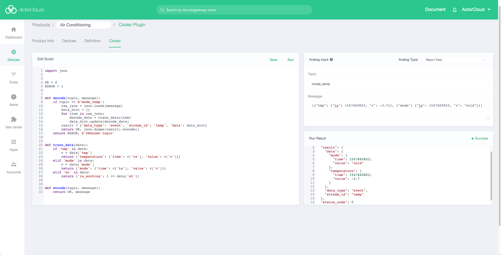

# ActorCloud codec plugin instructions

Codec plugin is used for encoding and decoding of messages between ActorCloud and devices

## 1. Function definition

Refer to [function definition](product.md#功能定义).

## 2. Codec Plug-in Programming




### Writing scripts

Scripts are written in `Python`, and the runtime environment is `Python 3.6`.

Write script code with reference to the data format specification. After testing for correct encoding and decoding, copy the code into the input box of edit script.

#### Analog input description

- Topic: message topic
- Message: JSON format, such as `{"temp":17}`，`[{"temp":17},{"hmd":80}]`

ActorCloud can convert data types.

### Running

Click the `Running` button to check if the results are as expected.

#### Running result description

- Error: script error or validation error
- Status_code: status code
- Result: the result after processing which will be specified in the follows.

##### Decoding

1. result` is the result of deserialization of the JSON string
2. The fields of `stream_id` and `data` of the decoding result must correspond to the data stream and data points defined by the product function, otherwise the verification fails.

The return format is as follows:

```json
{
  "status_code": 0,
  "result": {
    "data_type": "event",
    "stream_id": "stream_id",
    "data": {
      "temperature": {
        "time": 1547660823,
        "value": -3.7
      },
      "humidity": {
        "time": 1547660823,
        "value": 34
      }
    }
  }
}
```

##### Encoding

**Special note**, considering that the encoding will involve binary data,  the returned result is displayed as a string

The return format is as follows:

```json
{
  "result": "b'\\x01\\x00\\x01\\x0c\\x0e\\xcc\\xc4'",
  "status_code": 0
}
```

**Note**

The two functions of decode and encode needs to be included in codec script, otherwise the validation fails. If a function is not needed in the script, it can return directly

### Submit

The result can be submitted only if the result is not `error`. After clicking the 'Submit' button to submit, it needs to be reviewed by the administrator successfully before it can be used normally.

### Review

1. Log in with the super administrator account and go to: Device Management -> Product Management -> Codec Plugin review, click the `Rewiew` button of the corresponding product codec plugin.
2. Check the 'pass' in the review result, then click `OK` to make the codec plugin take effect.


## 3. Format description

`data_type` and `data` are required to fill.

### 1) Message report

- data_type: `event`
- stream_id: required to fill

`data` format is as follows:

```JSON
{
  "${field}": {
    "time": "${timestamp}",
    "value": "${value}"
  }
}
```

**Non-gateway**

```json
{
  "data_type": "event",
  "stream_id": "stream_id",
  "data": {
    "act_th": {
      "time": 1547661822,
      "value": 100
    },
    "act_time": {
      "time": 1547661822,
      "value": 23
    }
  }
}
```

**Gateway**

- gateway: gateway data
- devices: list of device data under the gateway, where `device_id` represents the device ID

```json
{
  "data_type": "event",
  "stream_id": "stream1",
  "data": {
    "gateway": {
      "status": {
        "time": 1547661822,
        "value": true
      }
    },
    "devices": [
      {
        "device_id": "device_id_1",
        "data": {
          "status": {
            "time": 1547661822,
            "value": true
          },
          "mode": {
            "time": 1547661822,
            "value": "cold"
          }
        }
      },
      {
        "device_id": "device_id_2",
        "data": {
          "status": {
            "time": 1547661822,
            "value": true
          },
          "mode": {
            "time": 1547661822,
            "value": "cold"
          }
        }
      }
    ]
  }
}
```

### 2) Request

The format is as follows:
```json
{
  "data_type": "request",
  "stream_id": "stream_id",
  "task_id": "d89ed1925a6d5c3184e1934244ad0000",
  "data": {
    "mode": "cold",
    "other_para": "test"
  }
}
```

- data_type:`request`

- stream_id: for platform instructions

- task_id: identify the task to be delivered for response

- data: publish content. When the custom command is selected, it corresponds to the actual input content. If the platform command is selected, it is:

  ```json
  {
    "${dataPointID}":"${value}",
  }
  ```

  For example, if the temperature function point (temp) is selected and value is set to 22, the corresponding data is:

  ```json
  {
    "temp": 22
  }
  ```

### 3) Response

Applicable to the situation where the content needs to be replied.

The format is as follows:

```json
{
   "data_type": "response",
   "result": {
      "task_id": "llasdah182anksjd",
      "code": 0
   },
   "data": {
      "mode": {
         "time": 1547661822,
         "value": "cold"
      },
      "other": {
         "time": 1547661822,
         "value": "xxxx"
      }
   }
}
```

- data_type:`response`
- result.task_id: corresponding published task_id
- result.code: status code, `0`: successful, `1`: failed
- data: response content. It can be an empty object{} when there is no response content


## 4. Codec function description

### 1) Encoding function description

Encode ActorCloud messages to the format required by the device

  ```python
  def encode(topic, message):
      ...
      return status_code, result
  ```

Parameter Description

- topic: `bytes` type, message topic
- message:`bytes` type, message payload

Return description

- status_code:`int` type, status code, `0`: successful, `1`: failed
- result:`bytes` type, encoding result

**Example**

```python
import json


OK = 0
ERROR = 1


def encode(topic, message):
    status_code = ERROR
    if topic == b'/19/1/0':
        raw_json = json.loads(message)
        data = raw_json.get('data')
        if data.get('lock') == 0:
            # unlock command
            status_code = OK
            result = b'\x01\x00\x01\x0c\x0e\xcc\xc4'
        elif data.get('lock') == 1:
            # lock command
            status_code = OK
            result = b'\x01\x00\x01\x0c\x0f\x0d\x04'
        else:
            result = b'Unknown command'
    else:
        result = b'Unknown topic'
    return status_code, result


if __name__ == '__main__':
    # mock data
    message = {
        'data_type': 'request',
        'stream_id': "stream_id",
        'task_id': 'd89ed1925a6d5c3184e1934244ad0000',
        'data': {
            'lock': 0
        }
    }

    encode_result = encode(b'/19/1/0', json.dumps(message).encode())
    print(encode_result)

```

Encoding result

```bash
(0, b'\x01\x00\x01\x0c\x0e\xcc\xc4')
```

### 2) Decoding function description

Parse reporting messages of device into a standard format defined by ActorCloud

```python
def decode(topic, message):
    ...
    return status_code, result
```

Parameter Description

- topic: `bytes` type, message topic
- message:`bytes` type, message payload

Return description

- status_code:`int` type, status code, `0`: successful, `1`: failed
- result:`bytes` type, encoding result

**Example**

```python
import json

OK = 0
ERROR = 1

def decode(topic, message):
    if topic == b'/19/0/0':
        raw_json = json.loads(message)
        data_dict = {}
        for item in raw_json:
            decode_data = _trans_data(item)
            data_dict.update(decode_data)
        result = {'data_type': 'event', 'stream_id': 'stream_id', 'data': data_dict}
        return OK, json.dumps(result).encode()
    return ERROR, b'Unknown topic'


def _trans_data(data):
    if 'temp' in data:
        v = data['temp']
        return {'temperature': {'time': v['ts'], 'value': v['v']}}
    elif 'hmd' in data:
        v = data['hmd']
        return {'humidity': {'time': v['ts'], 'value': v['v']}}
    elif 'st' in data:
        return {'is_working': 1 == data['st']}
   
if __name__ == '__main__':
    message = b'[{"temp": {"ts": 1547660823, "v": -3.7}}, {"hmd": {"ts": 1547660823, "v": 34}}]'
    decode_result = decode(b'/19/0/0', message)
    print(decode_result)
```

Decoding result:

```bash
(0, b'{"data_type": "events", "stream_id": 235, "data": {"temperature": {"time": 1547660823, "value": -3.7}, "humidity": {"time": 1547660823, "value": 34}}}')
```