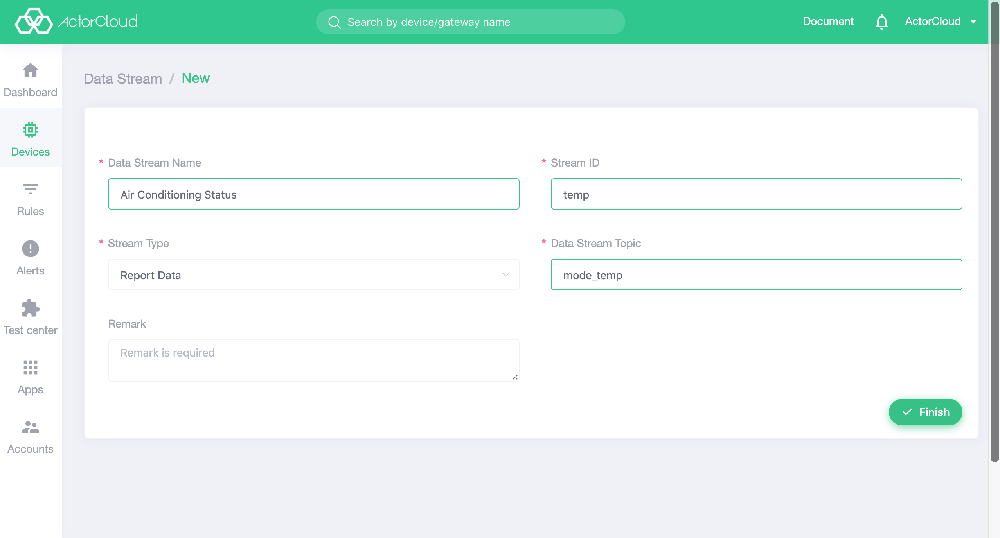
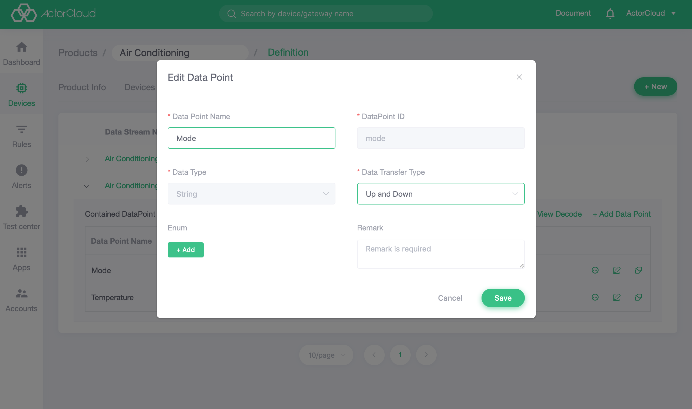

# Product Details

Click on the product card to view the product details. The product details include several basic modules such as **Product Information**, **Device Management**, **Function Definition**, **Codecide Plugin**. Different products display different functional modules according to the access protocol.

### Product information

View the basic information of the current product, and the product name and product description of the product can be edited.

### Device List

Display the list of devices under the current product, and the operation is the same as **Device Management** -> **Device List**.

### Function definition

Function definitions include data streams and data points. A product can have multiple data streams, and multiple data points can be bound under the data stream.

#### Data stream

Data streams are business information messages that products/devices can generate or consume.
A data stream contains one or more data points. A product can define multiple data streams, but the data flow topic under the same product cannot be duplicated. Click the function definition in the product details page to view the product data flow list.

The key information for the data flow definition is as follows:

- data flow identification: the ID used to identify the data stream;
- Flow type: Optional device data reporting, device data publish, data direction;
- data flow topic: the topic of the data stream for communication;

Definition example:

- The temperature and humidity sensor needs to report the temperature and humidity information, then the data stream name can be the temperature and humidity data stream, and the topic is `temp_hum`:



#### Data point

The data point is the most fine-grained capability or use of the product/device. A product can contain multiple data points that need to be bound to the data stream. Click the function definition in the product details page, and expand the sub-list under each line of data flow, a list of feature points under the data stream  can be viewed. After clicking Add Data Point, select the tab page of the existing data point to view all the data points under the product.

The key information for the data point definition is as follows:

- Data point identification: the JSON key value used by the function data in the transmission;
- Data transmission type: According to the actual application, the options of report only, publish only or both can be selected.
- Data type: based on the actual reported/published data definition;

| Type identifier | Name  | Post-conversion type|
| ----- | --------- | ------- |
|  1  | Value       | Float  |
|  2  | String    | String  |
|  3  | Boolean    | Boolean |
|  4  | Time      | String  |
|  5  | Location   | String   |

- Enumeration

Some data points have different meanings such as switch status, noise level, etc., which can be enumerated. Such data points can be added with enumeration options.

  - Actual value: the value actually reported and published;
- Display value: The value displayed on the ActorCloud interface.

Definition example:

- A temperature sensor needs to report the temperature information periodically, and the JSON data is reported as follows. The 'temperature' is the function point identification:

```json
{
  "data_type": "event",
  "stream_id": "temp_hum",
  "data": {
    "temperature": {
      "time": 1547661822,
      "value": 77
    },
  }
}
```

This function can be defined as shown in the following figure:


