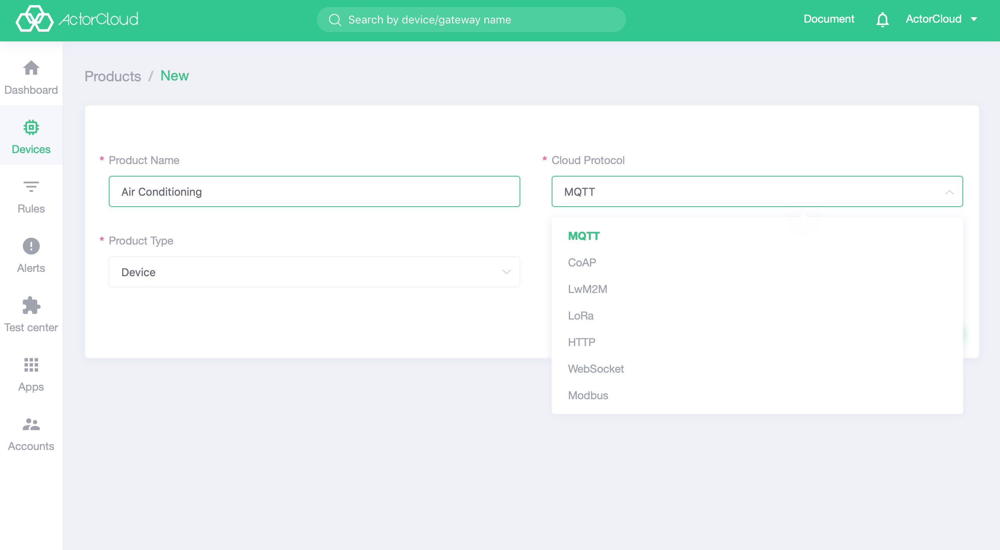

# Product creation

A product is an abstract collection of devices, a device is a specific instance of a product, and a device must correspond to a unique product.

Go to the Device Management -> Device List page and click on the **Products ** tab to view list of products.

Click the **New** button in the upper right corner to create a new product. Please select the corresponding **Cloud Protocol** according to the product access protocol, or select the corresponding product type of **Device** or **Gateway**. if gateway type is selected, the corresponding **Gateway Protocol** needs to be selected.

