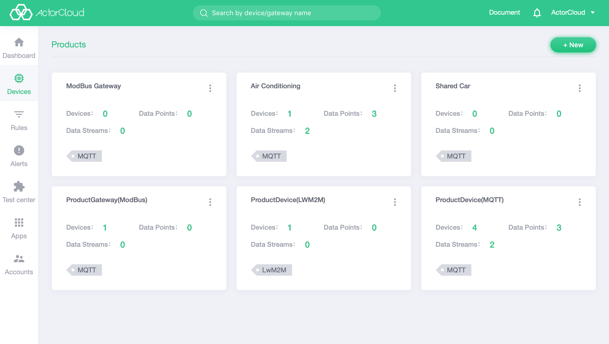

# Product list

A product is an abstract collection of devices. A device is a specific instance of a product. A device must correspond to a unique product. A non-empty product cannot be directly deleted.

Go to Device Management -> Product Management to view the product list:

- Click **Device Quantity** to view list of devices under the product;
- Click on **Data stream** or **Data point** to view the function definitions;
- Click the icon in the upper right corner of the card to implement the operation of **edit and delete** for the product;

