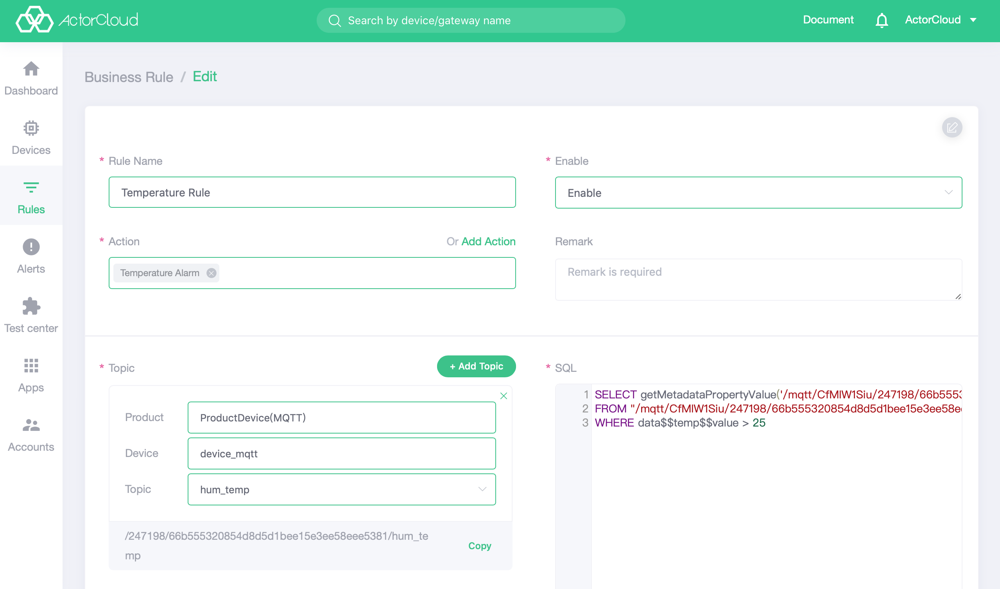

# Business Rule

The business rule is applied to the data flow reported to the platform by each device, and the action is triggered by the related rules and associations of the predefined data. When the data in the data stream satisfies the rule definition, the corresponding action can be triggered.

Before creating a business rule, [function definition](/products/product.md#功能定义) needs to be performed in advance.

The triggering of rules is in the way of `SQL`.

```sql
SELECT {payload}
FROM "{topic}"
WHERE condition
```

- `SELECT`：Message payload，`SELECT *`，`SELECT temperature AS temp`，`SELECT payload$$hum AS hum`(Applicable to  {"payload":{"hum":89}}) 

-  `FROM` ：Message topic, and the structure is as follows：
`/{protocol}/{tenantID}/{productID}/{deviceID}/{realTopic}`

Business rules SQL mainly contains associated object, conditional frequency and conditions.

#### 1. Associated object

The specific topic can be queried using the 'query topic' on the interface, and can be associated with the data stream of the specific device or all devices under the product according to the situation.

Data flow associated with a specific device
```
/mqtt/CcSMji6gp/bff530/dbabdf8ad91ef595bf9e9f35b1eef433/world
```

Data flow associated with all devices under the product, using the wildcard of '+'
```
/mqtt/CcSMji6gp/bff530/+/world
```

#### 2. Conditional frequency

In general, the platform supports the following types of conditional frequencies:

-  Triggered  each time when the condition is met.

   Example: rule of each time triggering when the temperature (temp) is greater than 10 each time the temperature (temp) is greater than 10

```sql
SELECT * 
FROM "/mqtt/CcSMji6gp/bff530/dbabdf8ad91ef595bf9e9f35b1eef433/world"
WHERE temp > 10
```


   - Trigger when the frequency is met: Triggered only when the data stream meets the condition for some times in certain time.

     Example: Trigger when temperature (temp) is greater than 10 that happened 5 times in 2 minutes

```sql
SELECT * 
FROM "/mqtt/CcSMji6gp/bff530/dbabdf8ad91ef595bf9e9f35b1eef433/world"
WHERE temp > 10
GROUP BY slidingwindow('mi', 2)
HAVING COUNT(*) >= 5
```

- Triggered when the condition persists: Triggered when the data stream satisfies the condition for several minutes/hour.

  Example: Trigger when temperature (temp) is greater than 10 and lasts 2 minutes

```sql
SELECT * 
FROM "/mqtt/CcSMji6gp/bff530/dbabdf8ad91ef595bf9e9f35b1eef433/world"
WHERE temp > 10
GROUP BY slidingwindow('mi', 2)
HAVING COUNT(*) = size()
```

- Triggered when it is not reported for some time.

  Example: Triggered when no data is reported within 2 minutes.

```sql
SELECT * 
FROM "/mqtt/CcSMji6gp/bff530/dbabdf8ad91ef595bf9e9f35b1eef433/world"
GROUP BY tumblingwindow('mi', 2)
HAVING size() = 0
```

#### 3. Condition

Similar to regular SQL



**pay attention**

If trigger action is selected as `alarm`, topic must be queried as follows:
```sql
SELECT getMetadataPropertyValue('/mqtt/CcSMji6gp/bff530/dbabdf8ad91ef595bf9e9f35b1eef433/world','topic') as topic,*
FROM "/mqtt/CcSMji6gp/bff530/dbabdf8ad91ef595bf9e9f35b1eef433/world"
```

**SQL Function description**

```
slidingwindow(String unit, long size)
```

```
tumblingwindow(String unit, long size)
```

| unit | Description |
| ---- | ---- |
| mc   | microsecond |
| tt/ms| millisecond |
| ss   | second |
| mi   | minute |
| hh   | hour |
| dd   | day |

```
String getMetadataPropertyValue(String topic, String property)
```
Get specific property values in the metadata, only the value of topic is supported here.