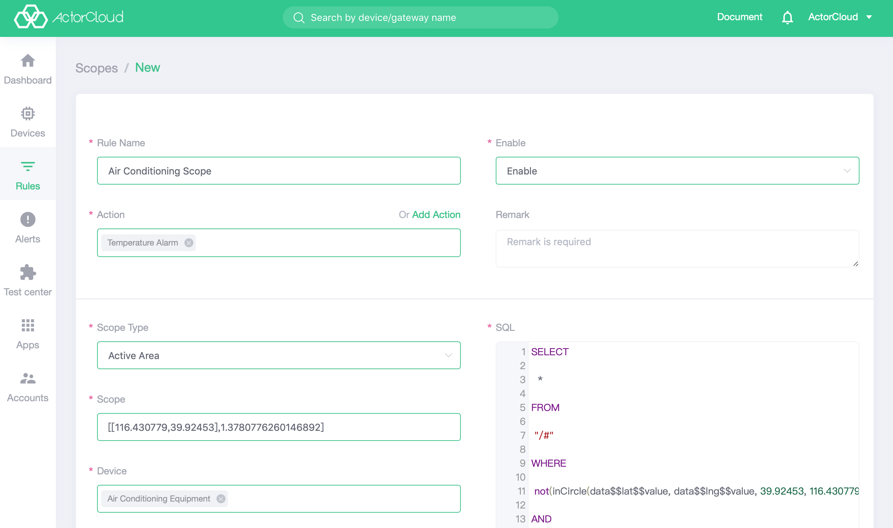

# Scope rule

The scope rule is mainly used for geographic information. User can set a scope for the device as the active area or the prohibited area. When the device exceeds the active area or enters the prohibited area, the rule is triggered.

In general, the scope rule SQL is automatically generated after the user selects it, and can be modified if the user needs it. The scope rules mainly consist of three parts.

**1. Scope type**

- Active area
- Prohibited area

**2. Scope range**

Support circular and polygonal scope by selecting on the map

**3. Associated device**

Select the device to be applied by the scope rule, and multiple selection is supported.



SQL Sample

```sql
SELECT split_part(getMetadataPropertyValue('/+/CcSMji6gp/#', 'topic'), '/' , 5) AS device_id
FROM "/+/CcSMji6gp/#"
WHERE inCircle(data$$lat, data$$lng, 39.917739, 116.357634, 2083.487794747287)
    AND device_id in ('client_id_5000','client_id_50001')
```

**Function description**

```
String split_part(String text, String delimiter, int position)
```
Parameter Description
- text: String to be split
- delimiter
- position: start from 1

This function returns a string at a specific position after splitting.
