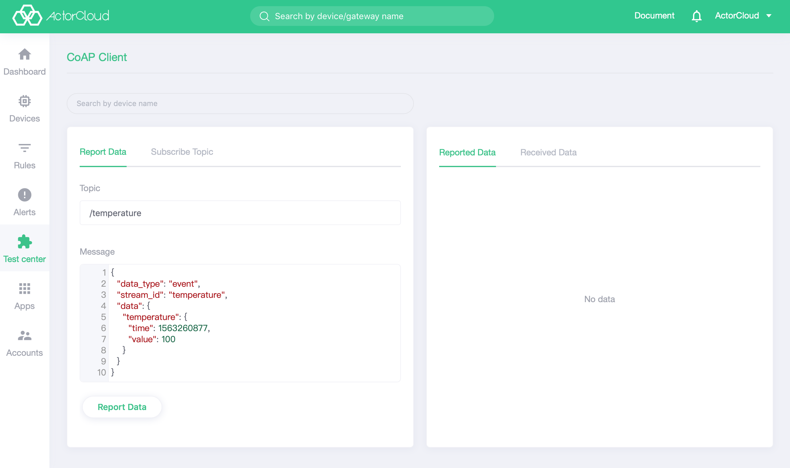

# CoAP client

- Once the device has been successfully created, click on **Test Center** -> **CoAP Client** to select the device for connection test. Select a device by device name search, click on the report data to send a message.




### Implementation of CoAP  in **ActorCloud**

- Only support GET and PUT methods at this time,  corresponding to the concept of **subscription**, **publish** respectively;
-  Logic and business functions of core layer are consistent with MQTT clients;
- Two-way authentication access is not supported at this time.

Sample code of CoAP connection:

```python
# --coding: utf-8--


from coapthon.client.helperclient import HelperClient


# The demo library only supports access using IP addresses

host = "139.198.190.35"
port = 5683
path = "/mqtt/hello_topic?c=10C61F1A1F40&u=10C61F1A1F40&p=ce07c199187811e8a12b525440546606"


def foo(response):
    print(response.pretty_print())


client = HelperClient(server=(host, port))
response = client.observe(path, callback=foo)

```

Sample code of one-way authentication:

```python
# --coding: utf-8--


import ssl
from socket import (socket, AF_INET, SOCK_DGRAM,
                    SOL_SOCKET, SO_REUSEADDR)
from dtls.wrapper import wrap_client
from coapthon.client.helperclient import HelperClient


# The demo library only supports access using IP addresses

host = "139.198.190.35"
# Default port 5683, one-way authentication using port 5684
port = 5684
path = "/mqtt/hello_topic?c=10C61F1A1F40&u=10C61F1A1F40&p=ce07c199187811e8a12b525440546606"

_sock = socket(AF_INET, SOCK_DGRAM)
_sock.setsockopt(SOL_SOCKET, SO_REUSEADDR, 1)
_sock = wrap_client(_sock,
                    # keyfile="./key.key",
                    # certfile="./cert.crt",
                    # 单向认证根证书
                    ca_certs="./root_ca.crt",
                    cert_reqs=ssl.CERT_NONE,
                    # ciphers="RSA",
                    do_handshake_on_connect=False)


def foo(response):
    print(response.pretty_print())


client = HelperClient(server=(host, port), sock=_sock)
response = client.observe(path, callback=foo)
```

> Reference project address:https://github.com/emqtt/emq-coap


#### Points for attention

- Only support GET and PUT methods at this time,  corresponding to the concept of **subscription**, **publish** respectively; 
- Two-way authentication access is not supported at this time.

