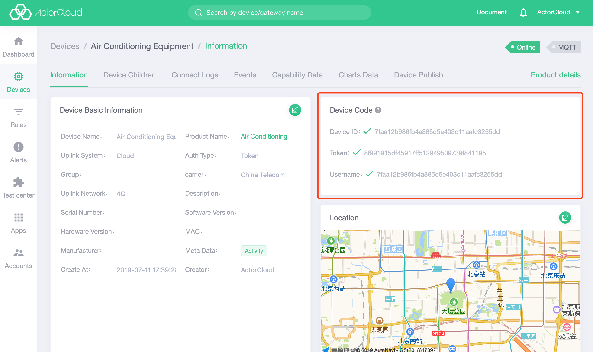

# MQTT Client


- Once the device has been successfully created, click on the **Test Center** -> **MQTT Client** to select the device for the connection test. Select a device by device name search and click Start to connect to the message server.

#### Operation guide

- Report data: input the topic and message for data reporting, the data format must be JSON;
- Subscribe to the topic: Enter a topic to subscribe online;
- Reported data: Contain only data that has been reported by the device since the MQTT client is connected;
- Received data: Contains only the data that has been received by the device since the MQTT client connected;


### Connection log

- The connection log will be generated by device connection. In the Device Details page **Connection Log**  tab, the running log of the current device can be viewed .


- According to the MQTT feature and the **ActorCloud** access rule, the devices with the same client Id cannot be online at the same time. Otherwise, the phenomenon of reconnecting and kicking off each other will occur. Please create a test device or select an offline device for debugging.


### Device event

- The  upstream message generated with device publishing message will be recorded to the device event, which can be viewed in the device details page **device event** tab page.


### Token authentication 

When the device authentication mode is **Token**, the device number, device key, and connection user name can be used connect to the message server:

- Device number: When the device is connected to the MQTT server, client_id is the device number;
- Device key: Corresponding to the MQTT connection password when the device is connected;
- Connection username: Corresponding to the MQTT connection username when the device is connected.

Through authentication information module in device authentication page  **Device Information** tab, the device authentication information can be viewed:



Sample code:

```python
# --coding: utf-8--

import paho.mqtt.client as mqtt
import json

# Devices need to be registered on the ActorCloud platform
client_id = '6198289b38939358305813fe41551483b1f0'
username = '6198289b38939358305813fe41551483b1f0'
password = '2312686198f5722ef570b855694655f1b475'
PORT = 1883
HOST = 'iot.actorcloud.io'


def on_connect(client, userdata, flags, rc):
    print('Connected with result code ' + str(rc))
    client.subscribe('some_topic')


#The messages published by device, group control and other methods are processed here.
def on_message(client, userdata, msg):
    print('topic: {0}, payload: {1}'.format(msg.topic, str(msg.payload)))
    # Other processing logic
    pass

# The device must be authenticated with a username and password.
client = mqtt.Client(client_id=client_id)
client.username_pw_set(username, password)

client.on_connect = on_connect
client.on_message = on_message

client.connect(HOST, PORT)

client.loop_forever()

```

### One-way authentication

- One-way authentication is applicable to devices with authentication mode **Token**, which requires device **encoding information** for authentication;

Sample code:

```python
# --coding: utf-8--

import ssl
import paho.mqtt.client as mqtt
import json

# Devices need to be registered on the ActorCloud platform
client_id = '6198289b38939358305813fe41551483b1f0'
username = '6198289b38939358305813fe41551483b1f0'
password = '2312686198f5722ef570b855694655f1b475'
HOST = 'iot.actorcloud.io'
PORT = 8883


def on_connect(client, userdata, flags, rc):
    print('Connected with result code ' + str(rc))
    client.subscribe('/hello')
    client.publish('/hello', json.dumps({
        'hello': 'world'
    }))


# The messages published by device, group control and other methods are processed here.
def on_message(client, userdata, msg):
    print('topic: {0}, payload: {1}'.format(msg.topic, str(msg.payload)))
    # Other processing logic
    pass

client = mqtt.Client(client_id=client_id)
# One-way authentication still requires a username and password
client.username_pw_set(username, password)
# Set certificate information
client.tls_set(certfile=None, keyfile=None, cert_reqs=ssl.CERT_REQUIRED, ciphers=None)
client.on_connect = on_connect
client.on_message = on_message

client.connect(HOST, PORT)

client.loop_forever()
```

# Two-way authentication

- Two-way authentication is applicable to devices with authentication mode **Certificate**, which requires **ActorCloud** root certificate + self-signed certificate and certificate key for authentication.


In the  details page of device binding certificate, click **Download Certificate** and extract the file to get the follows:

- **root_ca.crt** : **ActorCloud** root certificate;
- **Certificate name.crt** : Self-signed certificate;
- **Certificate name.key** :Self-signed certificate key;

> Devices that use two-way authentication connection do not require password authentication, but the two-way authentication device needs to bind and use a matching certificate to authenticate successfully.


Sample code:

```python
# --coding: utf-8--

import ssl
import paho.mqtt.client as mqtt
import json

# The device needs to be registered on the ActorCloud platform and the authentication method is "Certificate".
client_id = '6198289b38939358305813fe41551483b1f0'
username = '6198289b38939358305813fe41551483b1f0'
password = '2312686198f5722ef570b855694655f1b475'
HOST = 'iot.actorcloud.io'

# Two-way authentication port
PORT = 8884


def on_connect(client, userdata, flags, rc):
    print('Connected with result code ' + str(rc))
    client.subscribe('/hello')
    client.publish('/hello', json.dumps({
        'hello': 'world'
    }))


# The messages published by device,group control and other methods are processed here.
def on_message(client, userdata, msg):
    print('topic: {0}, payload: {1}'.format(msg.topic, str(msg.payload)))
    # Other processing logic
    pass

client = mqtt.Client(client_id=client_id)
# Two-way authentication only requires the use of a username
client.username_pw_set(username)
# Set PROT to 8884 and set the root certificate, signed certificate and key path
client.tls_set(ca_certs='./root_ca.crt', certfile='./default.crt', keyfile='./default.key', cert_reqs=ssl.CERT_REQUIRED,
    tls_version=ssl.PROTOCOL_TLS, ciphers=None)
client.on_connect = on_connect
client.on_message = on_message

client.connect(HOST, PORT)

client.loop_forever()
```


#### Points for attention

- According to the MQTT feature and the **ActorCloud** access rule, devices with the same ClientId cannot be online at the same time. Otherwise, the phenomenon of "reconnecting - kicking each other offline" will occur. Please create a test device or select an offline device for debugging.
- Two-way authentication access is not supported at this time.

