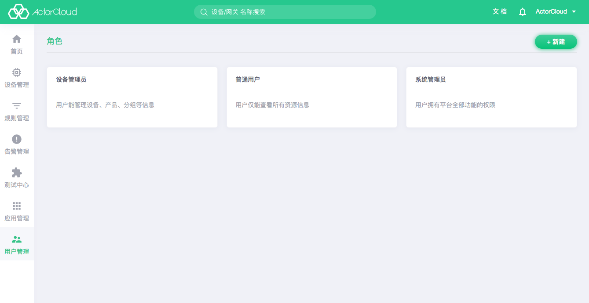

# User

**ActorCloud** provides complete system management functions. The operations such as user management, user permission control, invitation registration, and user role management can be performed by company account.

- Enter **User Management->Users** and click the **Users ** tab to view the list of users under the current account. Click **New ** in the upper right corner to create a user who belongs to the company where the current account is from. Assign them access permissions to the platform by selecting **role**. Select Manageable Groups to manage the device gateways under the group.
- New users must belong to a role. Before creating a new user, a role that the user belongs to must be created.

### User invitation

Go to **User Management -> User ** and click **Invite Record ** tab page to view the inviting record of current account , click  **invite**  in the upper right corner to invite user for registration, and the user belongs to the company of current account. **ActorCloud** will send an email containing the invitation link to the user's mailbox, and click the invitation link to complete the activation for registration.

# Role

Go to **User Management -> Roles**. Permissions of users must be assigned through user roles. New users need to be associated with related roles. **ActorCloud** provides three levels of  roles by default:

- Ordinary users: only can view all resource information;
- Device administrator: can manage devices, products and group, including the operation of creating, modifying, and deletion;
- System administrator: Having the full permissions of the platform functionality , including creating new users.

The default role does not allow modification, and new manual selection can be done if more subtle role control is required.

# Message Center

The message center contains some message notifications of **ActorCloud**.

# Login log

Go to **User Management->Login Log** to view all account login logs under the account of **ActorCloud**. It is supported to  search filtering for usernames and login IPs.

By viewing the login log, the abnormal logins can be checked and account security can be protected.

