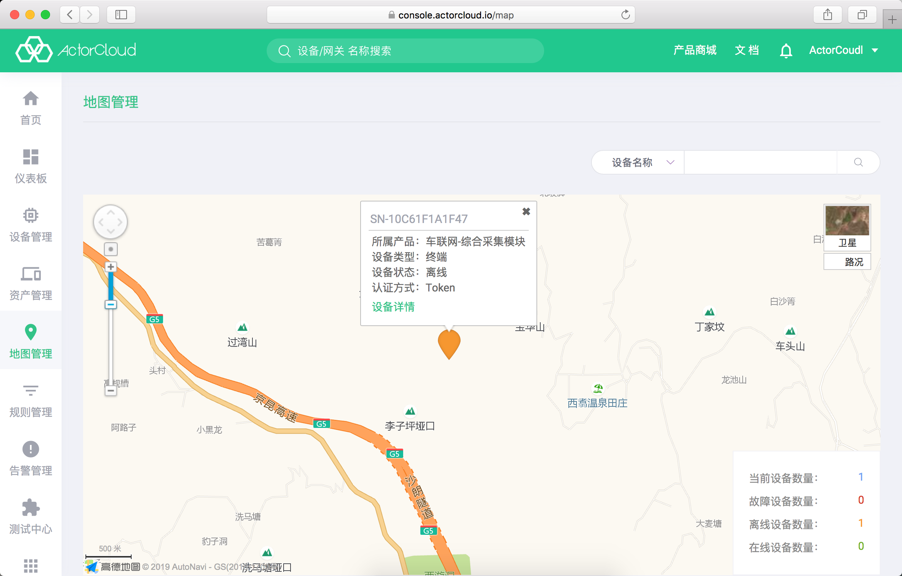
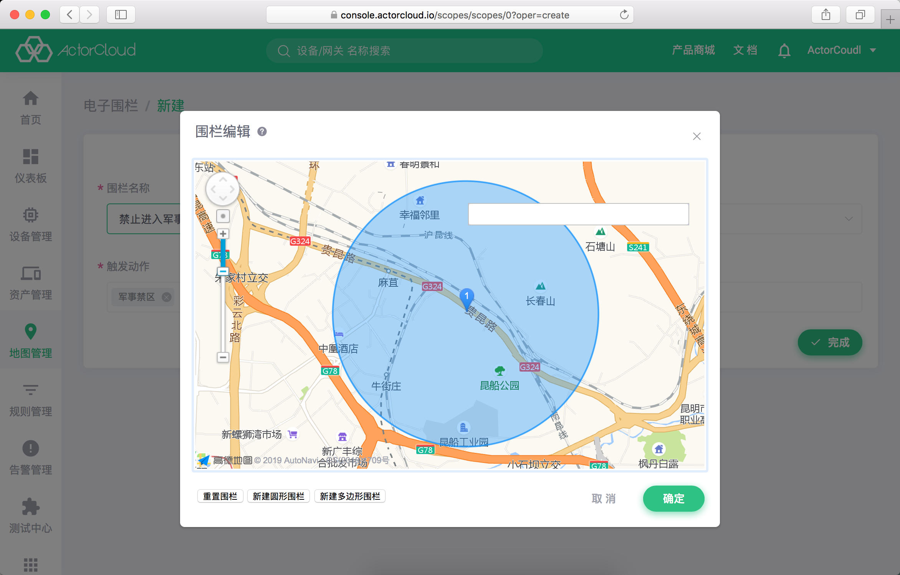
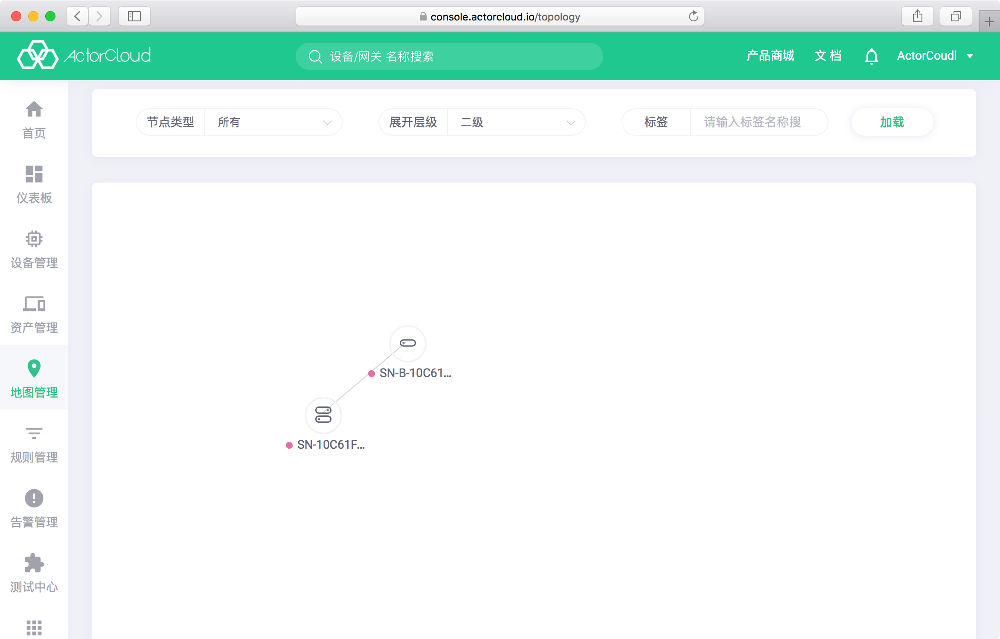

# 地图管理

**ActorCloud** 支持在地图上标注显示设备位置、电子围栏信息。

依次点击**地图管理** -> **位置管理**可在地图界面检索查看设备位置信息。

该页面支持按照设备名称、设备编号、所属产品、所属分组、认证方式等进行精确/模糊搜索展示。若标注点为红色则表明设备离线，绿色为设备在线。点击地图上设备位置标注点可以查看设备详细信息。

界面右下角显示当前设备状态统计信息。

# 电子围栏

依次点击**地图管理 ** -> **电子围栏**可进行电子围栏与围栏动作管理。

电子围栏定义了实际的地理区域，用于管理具有位置信息的设备。一个电子围栏可对应多个设备，结合**动作**实现设备进入/离开某个区域的监控与告警服务。

除必要的名称外，电子围栏还应当包含以下几个部分信息：

- 围栏类型：

  - 活动区域：设备预定在该区域活动，超出区域将触发预定动作；

  - 禁止区域：设备禁止进入的区域，进入区域将触发预定动作。

- 围栏范围：围栏的地理范围，通过地图弹框选择圆形围栏或多边形围栏。

- 触发动作：进入/离开围栏区域后触发的动作，支持多选。

# 拓扑管理

依次点击**地图管理 ** -> **拓扑管理**可进行拓扑管理。

拓扑管理定义了设备的层级关系，用于管理设备的层级关系。拓扑图的子设备图标里只有一个图，上联设备有2个图，当光标处在某个设备时，会显示相关的设备信息。

