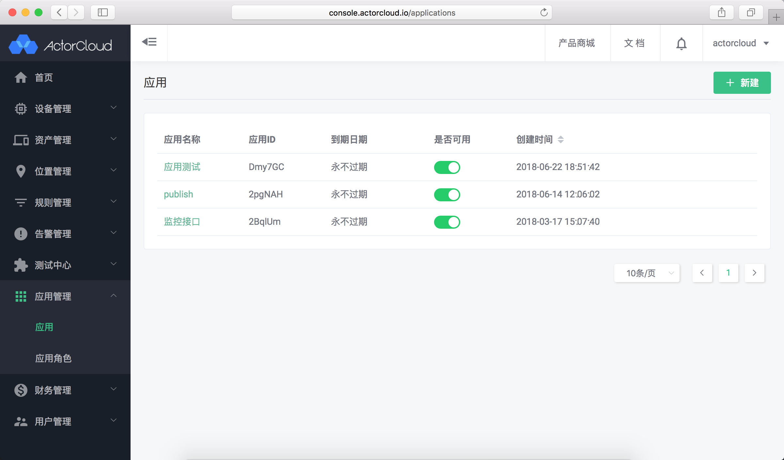
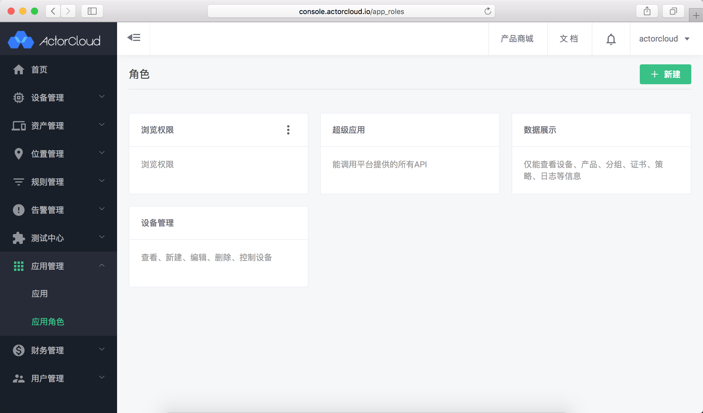
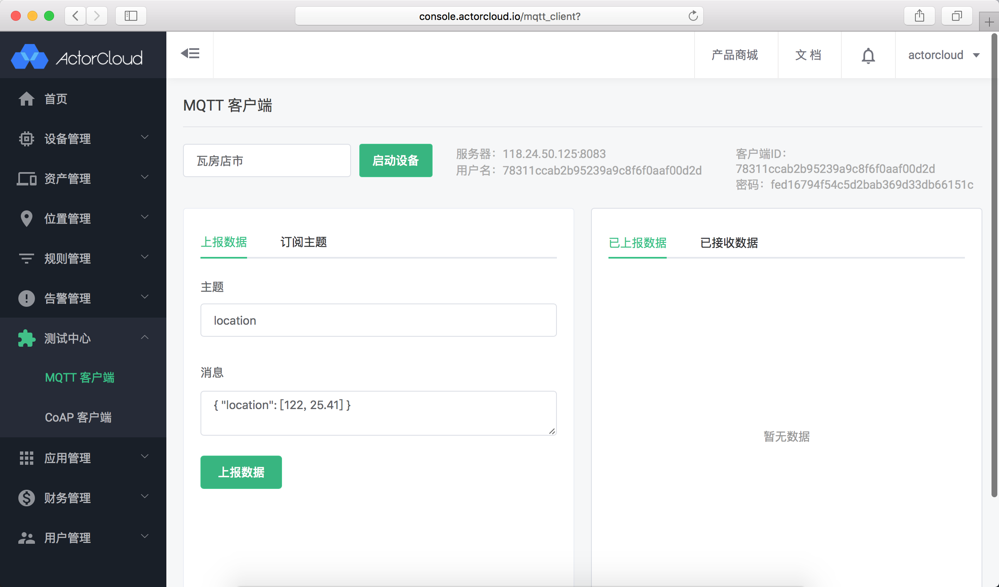
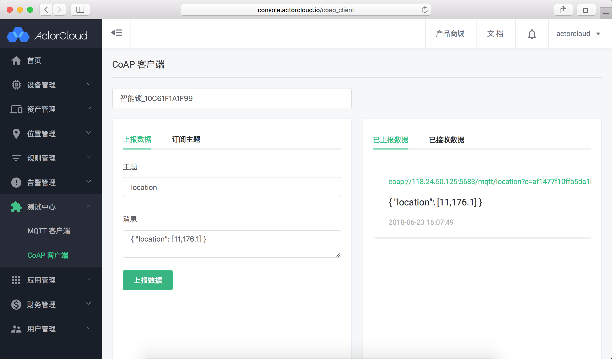
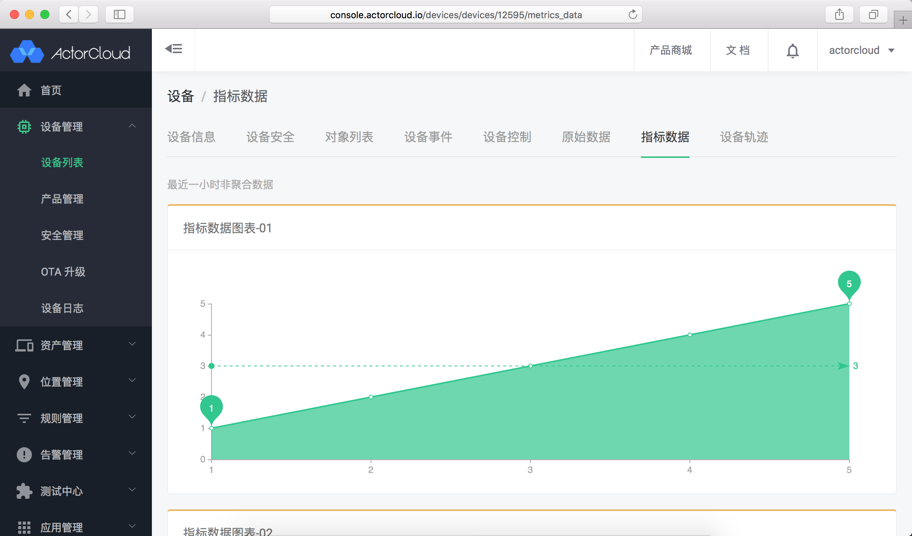
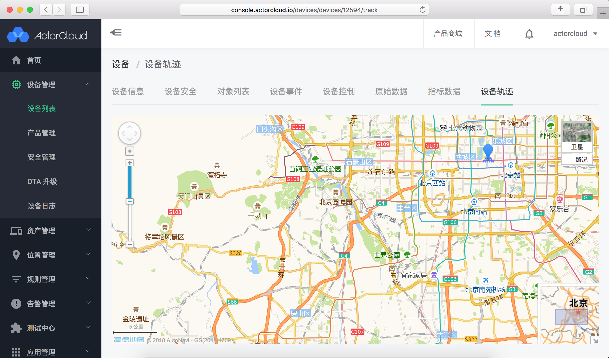
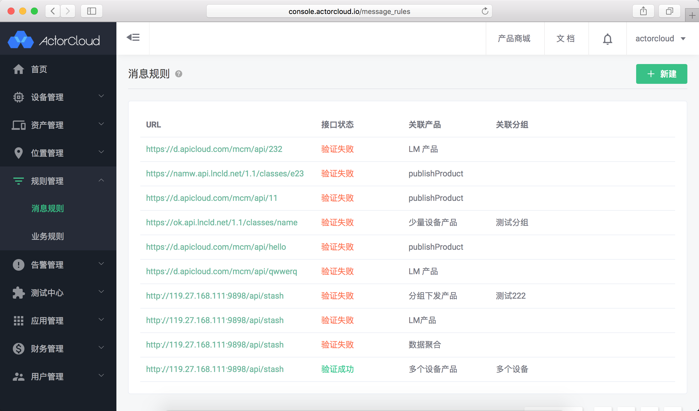
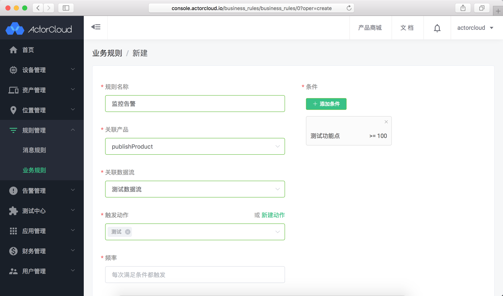
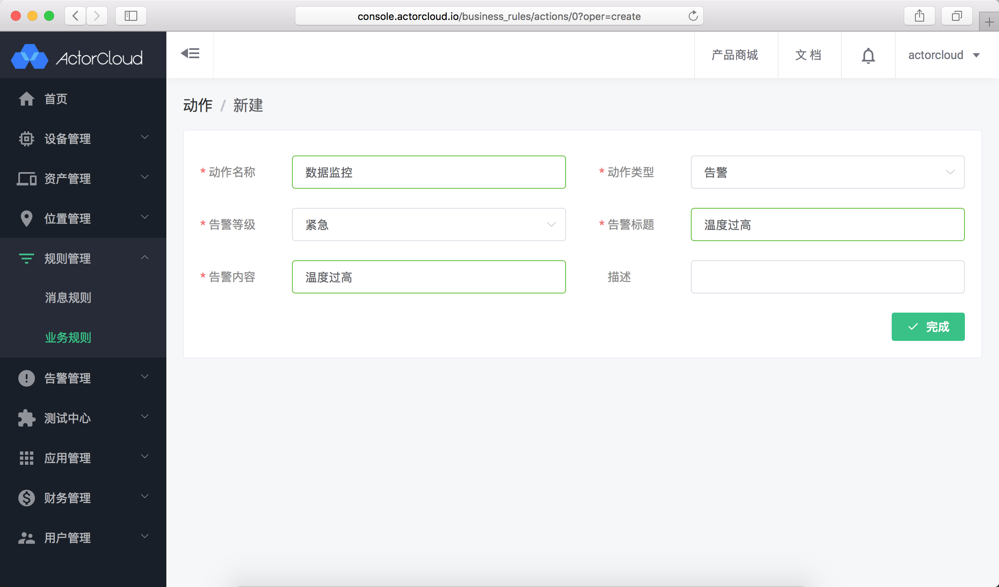

# AEP 服务

AEP 服务包含应用管理、测试中心、数据可视化与规则管理等扩展服务。

#### 应用管理

通过应用 ID 与应用密钥调用平台 API 的服务，用于外部应用开发使用，使用说明详见[应用管理](../application.md)。

**ActorCloud** 通过 REST API 接口提供如设备与产品的接入、安全性、消息与 ACL 等各类功能管理服务，方便外部应用快速集成开发。

- 应用管理

- 应用角色

#### 测试中心

使用 MQTT、CoAP 客户端在线连接到服务器进行测试，使用说明详见[测试中心](../mqtt.md)。

测试中心集成 MQTT、CoAP 客户端模拟设备接入服务器，自由发送数据，可用于大部分功能与场景测试。

- MQTT 客户端

- CoAP 客户端

#### 数据可视化

产品与设备数据流、指标等实时与聚合后的数据可视化展示服务。

数据可视化使得数据动态简明清晰，便于直观掌控设备信息，降低管理难度与提升运营效率。

- 指标数据

- 设备轨迹

#### 规则管理

定义接入设备数据流处理方案，将数据转发或进行数据校验进而监控设备状态服务，使用说明详见[规则管理](../rule_engine/rule_engine.md)。

支持定义如消息规则、业务规则等对设备上报数据进行实时处理，如同步至外部存储源、匹配关键数值进行监控告警。

- 消息规则

- 业务规则

- 动作

