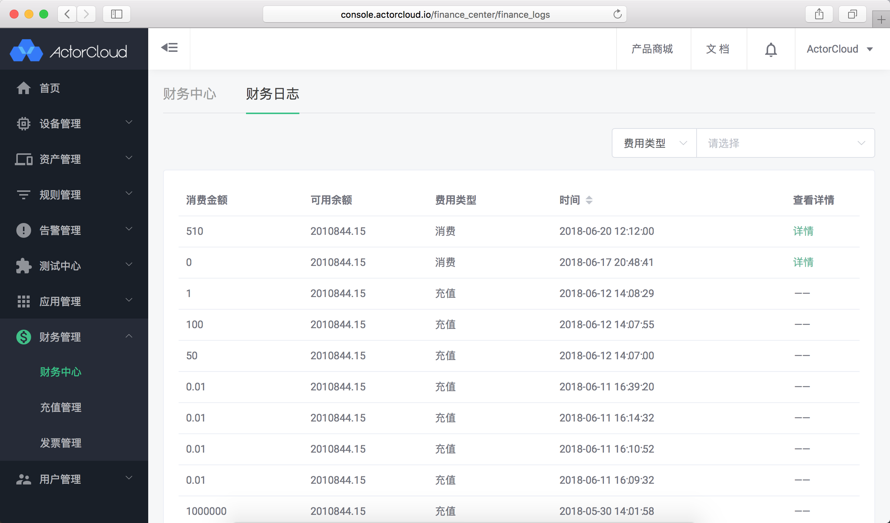

# 基础服务

基础服务包含基本的 **ActorCloud** 用户管理、财务管理、设备管理服务，基础服务默认开通且无法关闭。

#### 用户管理

登录用户管理，公司账号可以进行用户管理、用户权限控制、邀请注册、用户角色管理、消息中心管理等操作，使用说明详见[用户管理](../user.md)。

- 用户邀请

- 角色管理

#### 财务管理

集成账户下充值、已购套件账单、消费记录，发票信息与开票管理。

财务管理服务支持使用支付宝与微信进行余额充值，可进行账户充值、余额查看、各项消费信息与账单查看、发票信息管理、申请开发票等操作，使用说明详见[财务中心](../finance/finance.md)。

- 财务中心

- 财务日志界面

- 充值与充值记录

- 发票管理与开票记录

#### 设备管理

基础设备接入、认证与安全、消息事件、设备控制、订阅 ACL、分组等管理，使用说明详见[设备管理](../device/manage.md)。

- 设备列表

- 设备控制

- 设备安全

