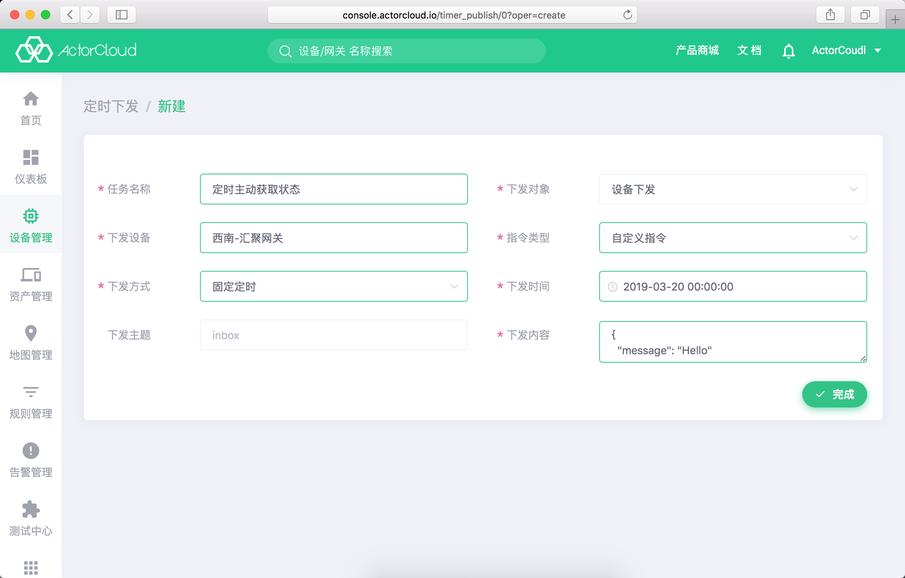

# 定时任务

定时任务用于向特定设备/特定分组定时下发控制指令。

新建定时任务时需指定操作设备或分组，指定定时方式，现支持下发方式如下：

- 定时不重复：支持任意日期、任意时间的秒级定时下发，指令只会下发一次；
- 定时重复：
  - 按小时：每小时的某一分钟秒级定时下发；
  - 按日：每天的某一时刻秒级定时下发；
  - 按周：每周中的某一天秒级定时下发。

定时任务创建成功后可在任务列表页查看详情。

