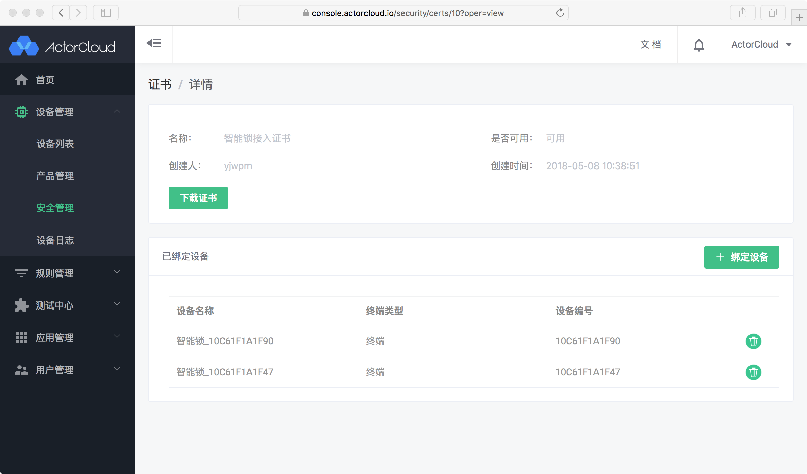
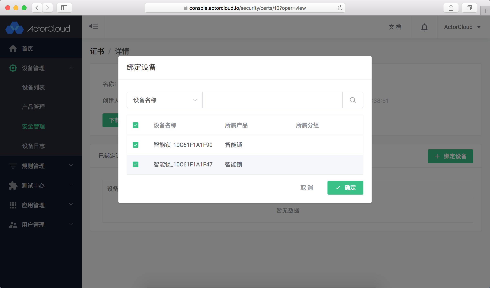

# 设备证书

**ActorCloud** 提供设备证书生成功能，支持证书与账户下任意设备绑定并配置其可用性。

依次点击**设备管理** -> **安全管理** -> **证书** 可进行证书的管理。

### 证书创建

输入证书名称，选择证书可用性后创建证书。创建后请立即下载并妥善保管好相关证书、密钥。

### 绑定设备

当设备使用 SSL/TLS 双向认证进行连接时应当使用其已绑定证书进行加密通信，在证书详情页可以修改证书信息，管理绑定设备。

### 使用示例

- 单向认证：使用端口 8883 进行 SSL/TLS 加密连接；

- 双向认证：使用端口 8884 进行 SSL/TLS 加密连接，客户端、服务器进行双向认证。

> 注意：双向认证设备需绑定并使用其匹配证书才能认证成功。

