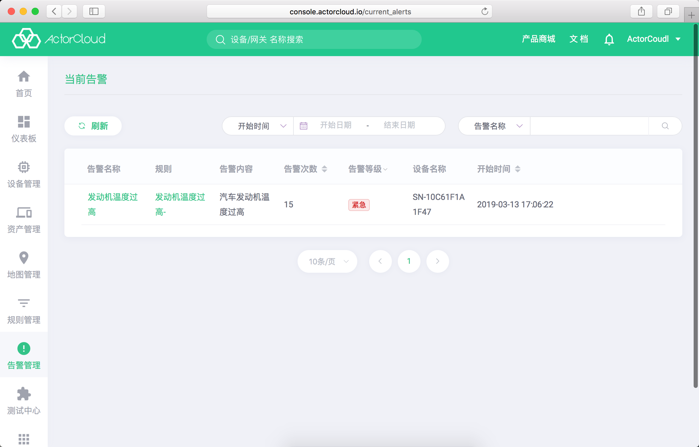

# 告警管理

[业务规则](/rule_engine/business_rules.md)或[围栏规则](/rule_engine/scope_rules.md)中触发动作类型为**告警**的动作信息将记录到告警管理中。

### 当前告警

当前已触发且持续存在告警信息，包含有告警内容，告警次数，告警等级。支持通过告警名称、设备名称和告警等级进行过滤搜索。同一条规则连续触发时将累加告警次数，新到消息告警不再存在时记录将自动移至历史告警，点击删除按钮可永久删除该记录。

### 历史告警

对于同一条规则，若新到消息不再触发告警，**当前告警**中相应的信息将移至**历史告警**。

历史告警包含有告警次数、开始时间、结束时间等信息，支持通过开始/结束时间区间、告警名称与设备名称过滤搜索，点击删除按钮可永久删除该记录。
