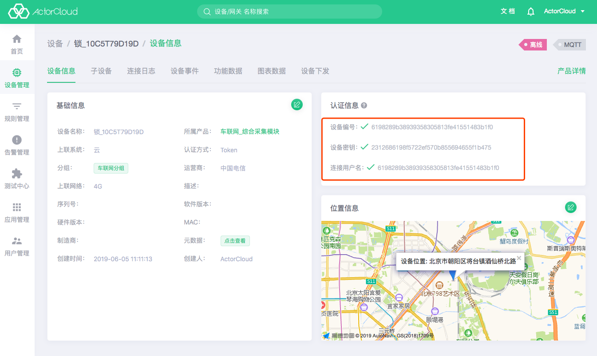

# 证书管理

在使用设备编号、设备密钥、连接用户名认证的基础上，平台还可以使用设备证书进行认证（需将相应设备的认证方式设置为证书认证），进一步保障通信安全性。

**ActorCloud** 提供设备证书生成功能，支持证书与账户下任意设备绑定并配置其可用性。


## 证书创建

- 输入证书名称，选择证书可用性后创建证书。创建后请立即下载并妥善保管相关证书。


## 绑定设备

- 设备使用 SSL/TLS 安全连接时应当使用已绑定证书进行加密通信，在证书详情页可以修改证书信息，管理绑定设备。注意：需要绑定的设备认证方式必须为证书。


## 单向认证

使用 8883 端口进行 SSL/TLS 加密通信：

- 设备使用设备编号、设备密钥、连接用户名认证
- 设备认证方式为 Token
- 设备接入地址为：`iot.acotecloud.io:8883`

使用设备编号，设备密钥，连接用户名可以连接到消息服务器：

- 设备编号：设备连接 MQTT 服务器时，client_id 即为设备编号；
- 设备密钥：对应设备连接时 MQTT 连接密码；
- 连接用户名：对应设备连接时 MQTT 连接用户名。

设备详情页的认证信息模块，可以查看设备认证信息:



示例接入代码：
```python
# --coding: utf-8--

import ssl
import paho.mqtt.client as mqtt
import json

# 设备需要在 ActorCloud 平台注册
client_id = '6198289b38939358305813fe41551483b1f0'
username = '6198289b38939358305813fe41551483b1f0'
password = '2312686198f5722ef570b855694655f1b475'
HOST = 'iot.actorcloud.io'
PORT = 8883


def on_connect(client, userdata, flags, rc):
    print('Connected with result code ' + str(rc))
    client.subscribe('/hello')
    client.publish('/hello', json.dumps({
        'hello': 'world'
    }))


# 设备下发 其他方式 publish 的消息统一在此处理
def on_message(client, userdata, msg):
    print('topic: {0}, payload: {1}'.format(msg.topic, str(msg.payload)))
    # 其他处理逻辑
    pass

client = mqtt.Client(client_id=client_id)

# 单向认证仍需要用户名密码
client.username_pw_set(username, password)

# 设置证书信息
client.tls_set(certfile=None, keyfile=None, cert_reqs=ssl.CERT_REQUIRED, ciphers=None)
client.on_connect = on_connect
client.on_message = on_message

client.connect(HOST, PORT)

client.loop_forever()

```

如果您使用 MQTT fx 测试，连接设置如下：

- 按照**设备安全**页面中提供的信息设置基础接入信息，使用 8883 端口，指定证书 SSL/TLS 加密方式


## 双向认证

使用 8884 端口进行 SSL/TLS 通信，服务器设备使用绑定的证书验证设备身份：

- 需要使用**设备编号**与**连接用户名**
- 设备认证方式为 证书
- 使用平台绑定设备的证书
- 设备接入地址为：`iot.acotecloud.io:8884`

设备绑定相应证书详情页中，点击下载证书后解压文件得到：

```bash
common_certs/
├── common.crt # 自签名证书；
├── common.key # 自签名证书密钥
└── root_ca.crt  # ActorCloud 根证书；
```

使用双向认证接入的设备无需密码验证，但设备需绑定并使用其匹配证书才能认证成功。


示例代码：
```python
# --coding: utf-8--

import ssl
import paho.mqtt.client as mqtt
import json

# 设备需要在 ActorCloud 平台注册且认证方式为 "证书"
client_id = 'ef14be2cfd2f555397bde858750cbda8'
username = 'ef14be2cfd2f555397bde858750cbda8'
password = '630a7f6b54d75e50a2e59b4baca722d4'
HOST = 'iot.actorcloud.io'

# 双向认证端口
PORT = 8884


def on_connect(client, userdata, flags, rc):
    print('Connected with result code ' + str(rc))
    client.subscribe('/hello')
    client.publish('/hello', json.dumps({
        'hello': 'world'
    }))


# 设备下发、分组控制及其他方式 publish 的消息统一在此处理
def on_message(client, userdata, msg):
    print('topic: {0}, payload: {1}'.format(msg.topic, str(msg.payload)))
    # 其他处理逻辑
    pass

client = mqtt.Client(client_id=client_id)
# 双向认证只需要使用用户名
client.username_pw_set(username)
# 设置 PROT 为 8884 并设置根证书、签名证书及密钥路径

client.tls_set(ca_certs='./common_certs/root_ca.crt',
	certfile='./common_certs/common.crt',
	keyfile='./common_certs/common.key',
	tls_version=ssl.PROTOCOL_TLSv1_2)

client.tls_insecure_set(True)

client.on_connect = on_connect
client.on_message = on_message

client.connect(HOST, PORT)

client.loop_forever()
```


如果您使用 MQTT fx 测试，连接设置如下：

- 按照**设备安全**页面中提供的信息设置基础接入信息，需要指定 Client ID 与 User Name，同时使用 8884 端口，指定证书 SSL/TLS 加密方式并设置自签名证书路径：


