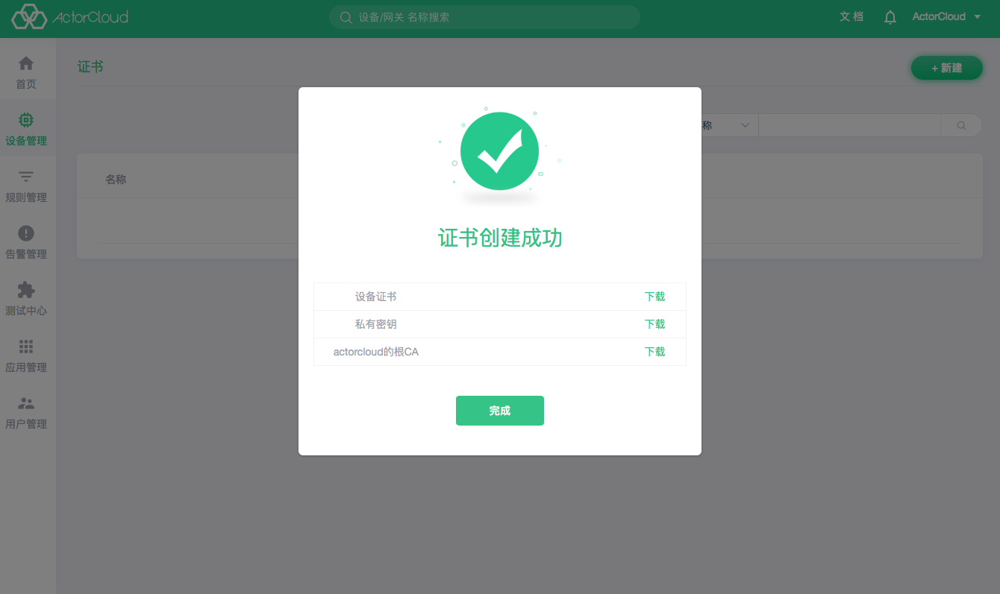

# 证书管理

在使用设备编号、设备密钥、连接用户名认证的基础上，平台还可以使用设备证书进行认证（需将相应设备的认证方式设置为证书认证），进一步保障通信安全性。

**ActorCloud** 提供设备证书生成功能，支持证书与账户下任意设备绑定并配置其可用性。

## 证书创建

- 输入证书名称，选择证书可用性后创建证书。创建后请立即下载并妥善保管相关证书。

## 绑定设备

- 设备使用 SSL/TLS 安全连接时应当使用已绑定证书进行加密通信，在证书详情页可以修改证书信息，管理绑定设备。注意：需要绑定的设备认证方式必须为证书。

