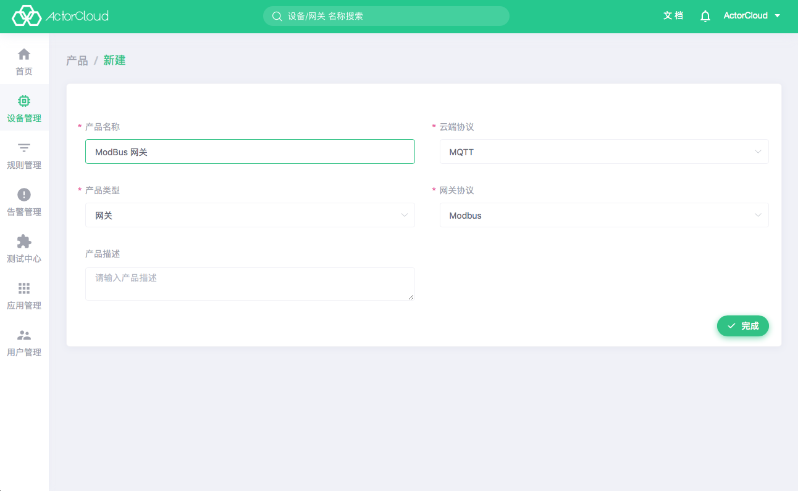
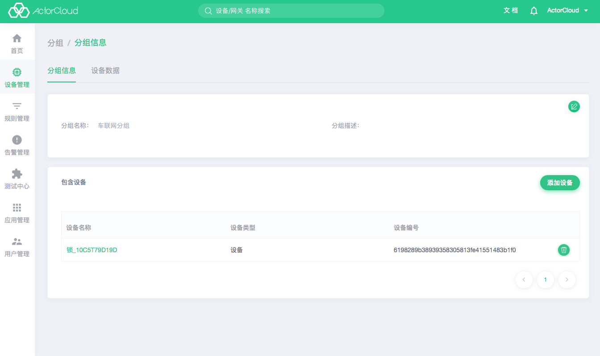

## 设备列表

点击 **设备管理** -> **设备** 标签页显示设备列表，点击列表页设备名称，进入设备信息页。该页包括
**设备信息**、**子设备**、**连接日志**、**设备事件**、**功能数据**、**图标数据**、**设备下发** 7 个页面，其功能与展示信息如下：

### 设备信息

- 基础信息：设备名称，所属产品，认证方式，上联系统等；
- 认证信息：设备的编号、密钥、连接用户名。
- 位置信息：在地图上展示设备位置信息；
- 右上角两个标签：分别显示设备的状态，如在线，离线。第二个标签显示该设备所属的协议名称。

点击设备基础信息，位置信息右上角编辑按钮可进行相关信息修改。基础信息不可修改所属产品，不同协议间的设备不可修改的信息可能不同。位置信息可以打开地图直接拖动图钉选择位置或搜索位置选择，也可以输入经纬度后自动定义相对应的位置：

### 连接日志

设备的的连接日志，即设备连接上/下线信息，显示的日志信息包含设备的上线、下线和认证失败。

### 子设备

设备上联系统可以是另一个设备，此处显示该设备下子设备列表，列表操作同设备列表。

### 设备事件

- 设备上行消息记录，即设备上报的消息，该页面无需刷新也可实时展示设备最新上报的消息。如需查看更多设备事件的数据，可跳转到历史数据页查看全部数据，还可根据上报时间和数据流尽心过滤搜索。

  

### 功能数据

- 设备上报的消息被解析出来的上报数据，该页面无需刷新也可实时展示设备最新上报后解析的消息。同样可以查看实时数据和历史数据，历史数据可根据上报时间和功能点进行过滤搜索。

  

### 图表数据

- 设备上报的数据，按不同的时间维度，以图表的形式实时展示该设备上报的数据流下的功能点数据。可按 5 分钟，1 小时，6 小时，1 天，1 周的时间范围内，显示该数据的图表。如功能点图表过多时，可以点击左上角自定义图表过滤显示你关注的功能点数据图表，所有数据都为实时数据。

  

### 设备下发

- **ActorCloud** 或 **外部应用** 向该设备下发的消息，点击**添加指令**可向当前设备即时或定时发送消息。

  - LwM2M 设备：
  
  支持 LwM2M 标准指令，填写对应的 PATH 为下发主题并下发到设备，对于**写**、**执行**操作需要额外添加执行指令；
  
  - 其他设备：
  
    - 自定义指令：自定义发送 JSON 格式的消息；

    - 平台指令：选取所属产品已定义的数据流，完善功能点后可发送；

- 定时任务：

如需周期性/定时向设备发送消息，可添加定时任务，所有平台的下发方式都支持定时下发。定时任务下发与普通指令一致，分为固定定时和间隔定时下发，固定定时在指定确定时间后下发该指令，间隔定时可以按每小时、每日、每周的固定时间，重复间隔时间后下发指令。

### 列表操作

设备列表页可进行更多设备操作，单选某一行设备后：

- 批量导出：将平台设备导出为 Excel 文件，无需选中设备，设备列表页点击**批量导出**即可导出全部设备；
- 批量导入：使用 Excel 模板文件导入设备信息；
- 指令下发：向选中设备下发指令；
- 任务配置：配置选中设备定时任务；
- 创建分组：从选中设备创建分组；

## 网关管理

**ActorCloud** 中具有汇聚设备消息、并连接至服务器的特殊设备可称作网关，如 LoRa 协议中的基站、NB-IoT 协议中的的运营商透传接口等。

点击 **设备管理** -> **网关** 标签页可进行接入网关的管理，点击列表页名称，可进入网关信息页，该页包括 **网关信息**、**设备管理**、**连接日志**、**网关事件**、**设备数据** 5 个页面，其功能与展示信息如下：

为方便管理统计，如设备上联系统为网关，需在设备新建时创建并选择相应网关。

### 网关信息

显示基本的网关信息，页面和设备信息相同，显示基础信息，认证信息，位置信息三个模块。网关信息比设备信息多一个网关协议。MQTT 透传协议的网关可通过网关编号，网关用户名，网关密钥连接至 **ActorCloud**。

### 设备管理

当设备的上联系统为网关时，并且选中当前网关，网关下就可以绑定一个设备，该列表就是展示网关下绑定的设备。列表操作同设备列表。

### 连接日志

网关连接日志和设备的的连接日志相同，即网关连接上/下线信息。

### 网关事件

实时显示该网关上报的消息，同设备事件功能类似。

### 设备数据

显示网关设备的最新数据。

## 分组管理

分组为设备和网关的一个业务集合，同一个设备可以在不同分组中，分组可以同时绑定网关和设备。

进入 **设备管理** -> **分组** 标签页，可查看分组列表：

- 点击**设备数量**查看分组下设备列表；
- 点击**网关数量**查看分组下网关列表；
- 点击右上角的**新建**按钮可进行分组新建操作。

点击列表页名称，可进入分组信息页，该页包括 **分组信息**、**设备数据** 2 个页面，其功能与展示信息如下

### 分组信息

可以编辑和和查看分组信息，可以进行分组内设备和网关的管理操作：

- **包含设备**列表内可添加或移除当前分组内设备和网关；

- 点击**添加设备**可添加符合规则的设备到当前分组。

### 设备数据

分组的设备数据和网关的设备数据功能类似，可以查看该分组下所有设备的最新数据。
