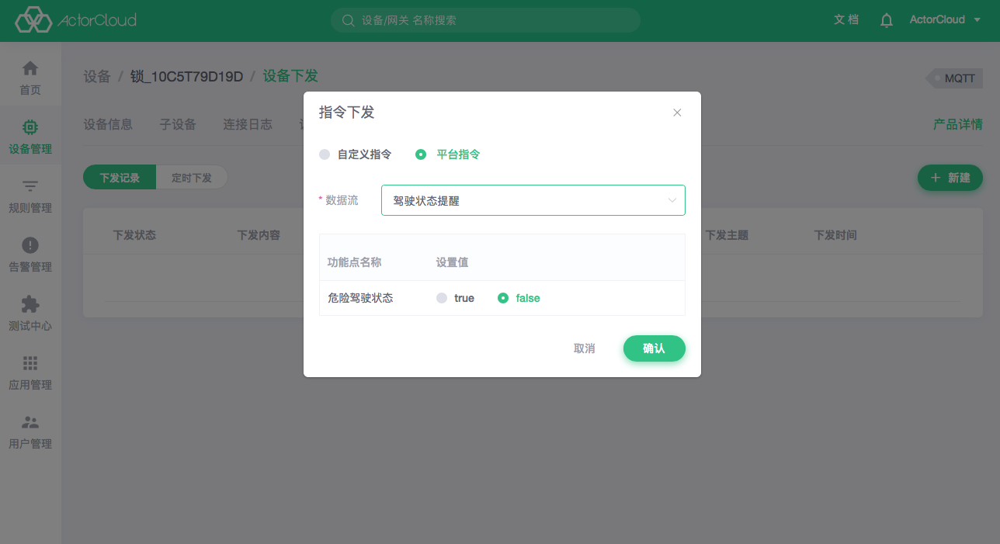

## 设备列表

点击**设备**列表页设备名称，进入设备信息页。该页包括
**设备信息**、**子设备**、**连接日志**、**设备事件**、**功能数据**、**图标数据**、**设备下发** 7 个页面，其功能与展示信息如下：

### 设备信息

- 设备状态信息：设备在线时显示连接时间、客户端 IP、心跳时间；
- 运行日志：即设备连接上/下线信息；
- 设备告警：当前设备触发的告警记录；
- 设备基本信息：设备名称，设备类型认证方式，上联系统等；
- 位置信息：在地图上展示设备位置、围栏范围等信息；
- 终端列表：设备为网关时展示包含终端列表。

点击设备基础信息，位置信息右上角编辑按钮可进行相关信息修改：

### 设备安全

包含有设备认证、服务器连接、证书等信息：

- 设备认证信息：设备连接 Token 认证信息；

- MQTT服务器信息：平台 MQTT 协议接入地址；

- CoAP服务器信息：平台 CoAP 协议接入地址；

- 已绑定证书：绑定/取消绑定操作，绑定证书下载，用于管理设备证书连接；

> 编码信息、证书为设备连接认证重要信息，请妥善保管。

### 子设备

设备上联系统可以是另一个设备，此处显示该设备下子设备列表。

### 设备事件

- 设备上行消息记录，即设备上报的消息，该页面无需刷新也可实时展示设备最新上报的消息。

  

### 设备下发

- **ActorCloud** 或 **外部应用** 向该设备下发的消息，点击**添加指令**可向当前设备即时或定时发送消息。

  - LWM2M 设备：
  
  支持选取所属产品已添加的产品属性并下发指令到设备，对于**写**、**执行**操作需要额外添加执行指令；
  
  - 其他设备：
  
    - 平台指令：选取所属产品已定义的数据流，完善功能点后可发送；

    - 自定义指令：自定义发送 JSON 格式的消息；

- 定时任务：

如需周期性/定时向设备发送消息，可添加定时任务，定时任务下发与普通指令一致。

### 列表操作

设备列表页可进行更多设备操作：

- 批量导出：将平台设备导出为 Excel 文件，无需选中设备，设备列表页点击**批量导出**即可导出全部设备；
- 批量导入：使用 Excel 模板文件导入设备信息；
- 登录设备：通过 ssh 登录到设备下发台（需设备支持）；
- 指令下发：向选中设备下发指令；
- 任务配置：配置选中设备定时任务；
- 创建分组：从选中设备创建分组（仅限同一产品下设备）。

## 网关管理

**ActorCloud** 中具有汇聚设备消息、并连接至服务器的特殊设备可称作网关，如 LoRa 协议中的基站、NB-IoT 协议中的的运营商透传接口等。

点击**设备管理** -> **网关管理** 可进行接入网关的管理。

为方便管理统计，如设备上联系统为网关，需在设备新建时创建并选择相应网关。

### 网关信息

显示基本的网关信息，MQTT 透传协议的网关可通过网关编号，网关用户名，网关密钥连接至 **ActorCloud**。

#### 网关通道 (适配 Modbus 网关)

- 1.Modbus 网关详情页点开 网关通道 后面的 点击查看 按钮，进入网关通道配置；

- 2.点开 添加通道，先选择通道类型。通道类型可选择 COM、TCP，驱动类型可选择 Modbus TRU (COM类型)、Modbus TCP (TCP类型)；

- 3.创建一个 COM 类型的通道。其中 Baud 表示串口波特率，Data 表示数据位，Stop 表示停止位，Parity 表示奇偶校验位。注意：一个网关只能创建一个 COM 通道，并且不可与 TCP 通道并存；

- 4. 创建一个 TCP 类型的通道(需把前面创建 COM 通道删除)，注意：一个网关最多可创建 9 个 TCP 通道，并且不可与 COM 通道并存。

### 网关事件

实时显示该网关上报的消息，同设备事件功能类似。

### 网关控制

将配置信息下发更新至网关。

### 设备数据

显示网关设备的最新数据

## 分组管理

分组为设备的一个业务集合，同一个设备可以在不同分组中。

进入设备管理->设备列表页面，点击**分组**标签页，可查看分组列表：

- 点击**设备数量**查看分组下设备列表；
- 点击右上角的**新建**按钮可进行分组新建操作。

### 分组操作

在**分组**编辑和查看页，可以进行分组内设备的管理操作：

- **包含设备**列表内可移除当前分组内设备；

- 点击**添加设备**可添加符合规则的设备到当前分组。

  

