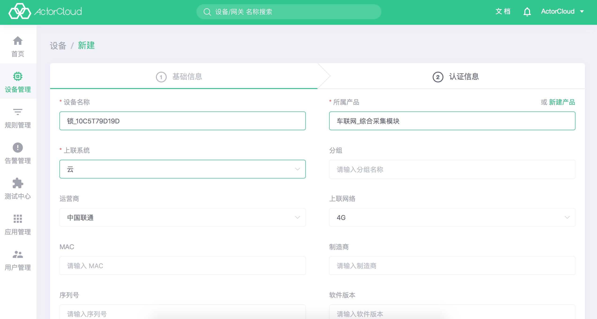
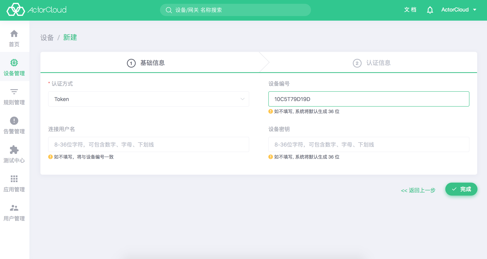

# 新建设备

### 注册设备

**设备**列表页中，点击右上角**新建**按钮可进行设备新建操作，设备必须对应一个产品，新建设备前需创建好设备所属产品。

设备信息包含基本信息与认证信息，认证信息里的**设备编号**、**连接用户名**、**设备密钥**需按指定规则如实填写，一经填写不可更改。

### 认证方式区别：

- Token：使用**设备编号**与**用户名**  **密码** 连接，支持普通TCP或者SSL/TLS 单向认证；

- 证书：需要设备[绑定证书](../device/security.md#绑定设备)并使用双向认证进行连接，选择证书认证后，设备连接时只能携带证书信息进行认证，不需要再携带用户名与密码。

> 认证信息如不填写, 系统将默认生成36位字符，建议留空由系统自动生成。
