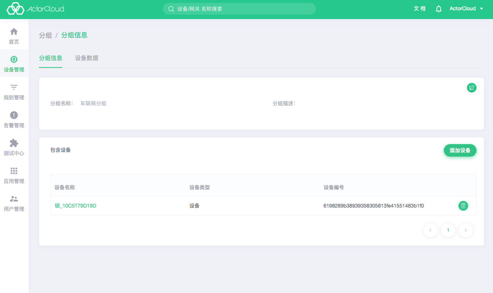

# 分组管理

分组为设备和网关的一个业务集合，同一个设备可以在不同分组中，分组可以同时绑定网关和设备。

进入 **设备管理** -> **分组** 标签页，可查看分组列表：

- 点击**设备数量**查看分组下设备列表；
- 点击**网关数量**查看分组下网关列表；
- 点击右上角的**新建**按钮可进行分组新建操作。

点击列表页名称，可进入分组信息页，该页包括 **分组信息**、**设备数据** 2 个页面，其功能与展示信息如下

### 分组信息

可以编辑和和查看分组信息，可以进行分组内设备和网关的管理操作：

- **包含设备**列表内可添加或移除当前分组内设备和网关；

- 点击**添加设备**可添加符合规则的设备到当前分组。

### 设备数据

分组的设备数据和网关的设备数据功能类似，可以查看该分组下所有设备的最新数据。