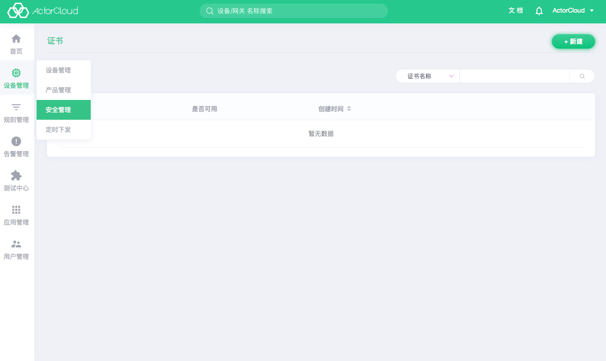

# 安全管理

**ActorCloud** 提供多种维度的接入与通信安全管理：

证书接入：

1. 接入安全等级较低时，为兼顾设备接入性能可以可以使用 Token 认证在接入阶段进行认证，使用非加密的 TCP 连接通信；

2. 接入安全等级较高时，在 1 的基础上可以使用 SSL/TLS 加密通信，保障数据传输阶段中的安全；

3. 使用证书双向认证，将平台创建的证书绑定并烧录进设备可以提供高级别的安全保障（平台上设备认证方式需为“证书”）。

创建证书的方法，可参考[证书管理](./certs.md)

