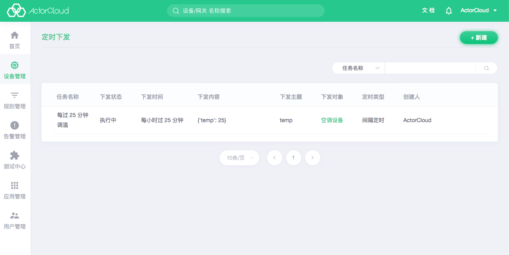
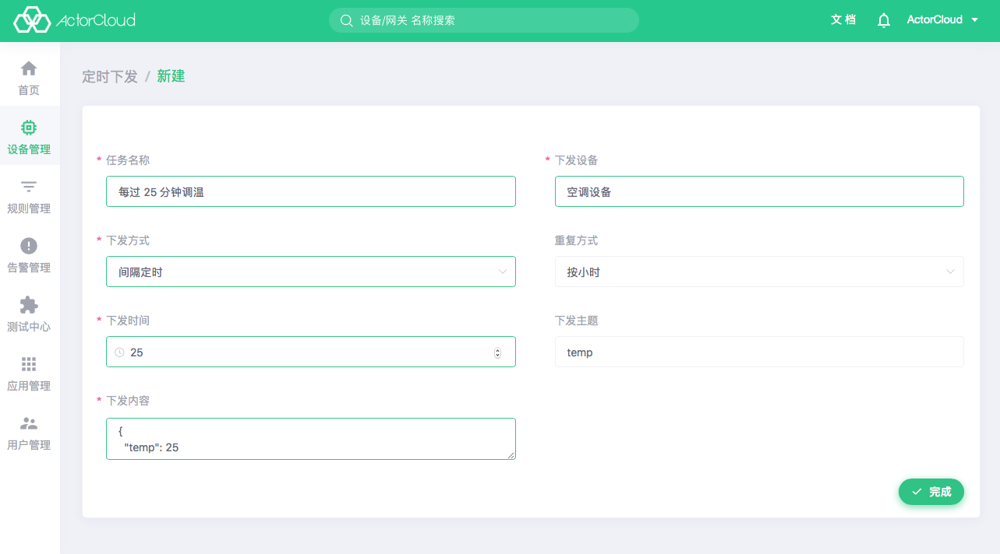

# 定时下发

点击 **设备管理** -> **定时下发** 标签页，可显示平台内所有设备的定时下发记录。定时任务是周期性/定时向设备发送消息，所有设备都可添加定时任务，所有平台的下发方式都支持定时下发。该列表可以查看设备的定时下发的时间，内容和主题等信息。列表还可以通过任务名称和定时类型进行过滤搜索。

点击右上角新建，选择设备后，可创建一个定时下发指令。下发方式分为固定定时和间隔定时下发，固定定时在指定确定时间后下发该指令，间隔定时可以按每小时、每日、每周的固定时间，重复间隔时间后下发指令，下发内容的数据格式为 `JSON`。

