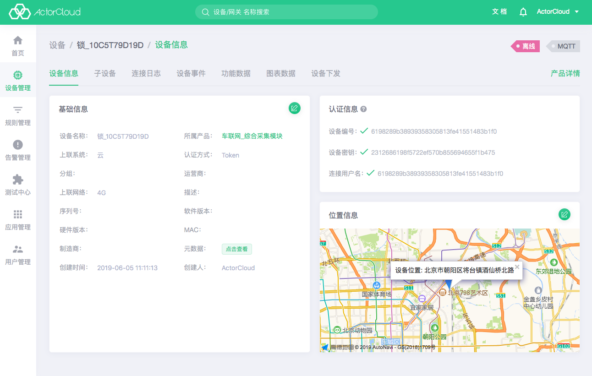

# 设备详情

点击 **设备管理** -> **设备** 标签页显示设备列表，点击列表页设备名称，进入设备信息页。该页包括
**设备信息**、**子设备**、**连接日志**、**设备事件**、**功能数据**、**图标数据**、**设备下发** 7 个页面，其功能与展示信息如下：

### 设备信息

- 基础信息：设备名称，所属产品，认证方式，上联系统等；
- 认证信息：设备的编号、密钥、连接用户名。
- 位置信息：在地图上展示设备位置信息；
- 右上角两个标签：分别显示设备的状态，如在线，离线。第二个标签显示该设备所属的协议名称。

点击设备基础信息，位置信息右上角编辑按钮可进行相关信息修改。基础信息不可修改所属产品，不同协议间的设备不可修改的信息可能不同。位置信息可以打开地图直接拖动图钉选择位置或搜索位置选择，也可以输入经纬度后自动定义相对应的位置：

### 连接日志

设备的的连接日志，即设备连接上/下线信息，显示的日志信息包含设备的上线、下线和认证失败。

### 子设备

设备上联系统可以是另一个设备，此处显示该设备下子设备列表，列表操作同设备列表。

### 设备事件

- 设备上行消息记录，即设备上报的消息，该页面无需刷新也可实时展示设备最新上报的消息。如需查看更多设备事件的数据，可跳转到历史数据页查看全部数据，还可根据上报时间和数据流尽心过滤搜索。

  

### 功能数据

- 设备上报的消息被解析出来的上报数据，该页面无需刷新也可实时展示设备最新上报后解析的消息。同样可以查看实时数据和历史数据，历史数据可根据上报时间和功能点进行过滤搜索。

  

### 图表数据

- 设备上报的数据，按不同的时间维度，以图表的形式实时展示该设备上报的数据流下的功能点数据。可按 5 分钟，1 小时，6 小时，1 天，1 周的时间范围内，显示该数据的图表。如功能点图表过多时，可以点击左上角自定义图表过滤显示你关注的功能点数据图表，所有数据都为实时数据。

  

### 设备下发

- **ActorCloud** 或 **外部应用** 向该设备下发的消息，点击**添加指令**可向当前设备即时或定时发送消息。

  - LwM2M 设备：
  
  支持 LwM2M 标准指令，填写对应的 PATH 为下发主题并下发到设备，对于**写**、**执行**操作需要额外添加执行指令；
  
  - 其他设备：
  
    - 自定义指令：自定义发送 JSON 格式的消息；

    - 平台指令：选取所属产品已定义的数据流，完善功能点后可发送；

- 定时任务：

如需周期性/定时向设备发送消息，可添加定时任务，所有平台的下发方式都支持定时下发。定时任务下发与普通指令下发一致，定时任务分为固定定时和间隔定时下发，固定定时在指定确定时间后下发该指令，间隔定时可以按每小时、每日、每周的固定时间，重复间隔时间后下发指令。

