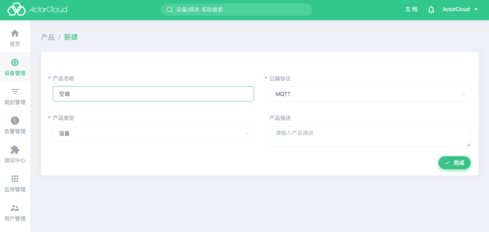
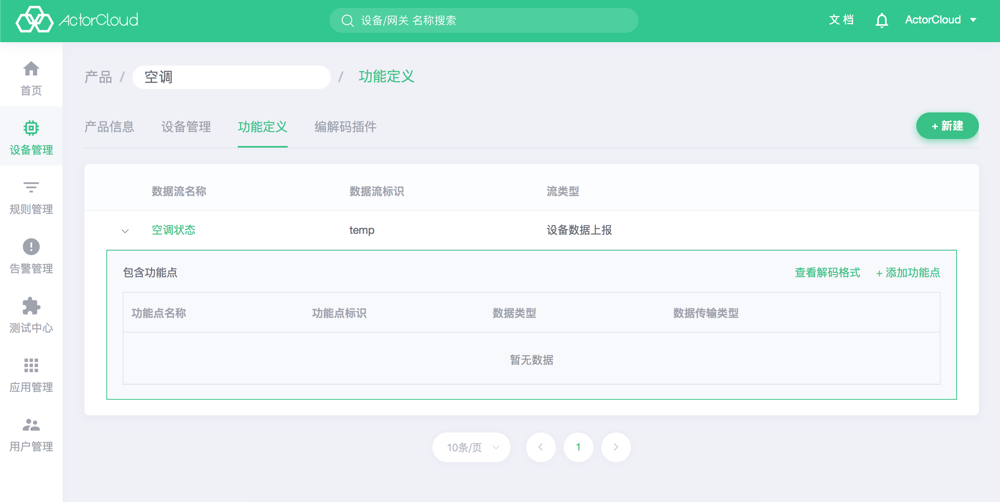
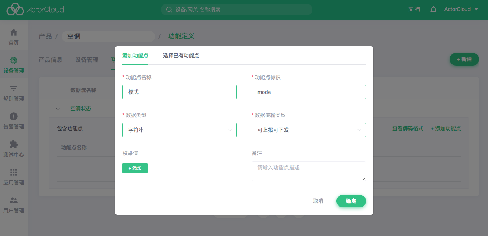
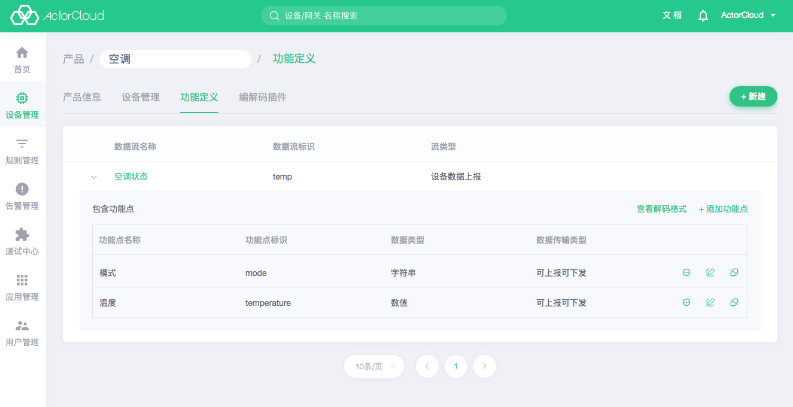
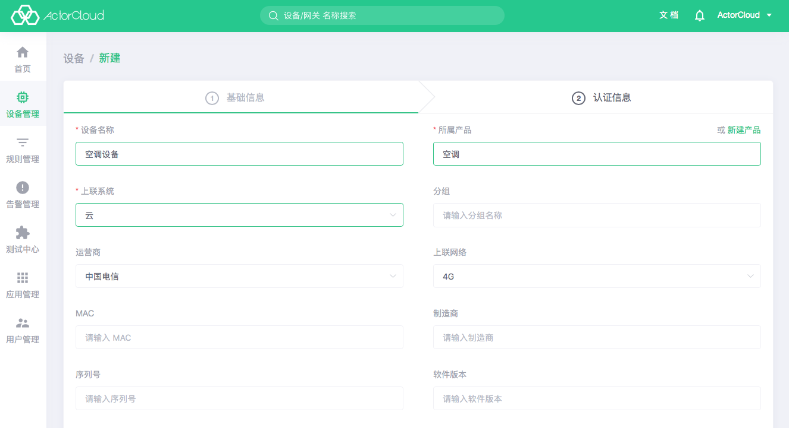
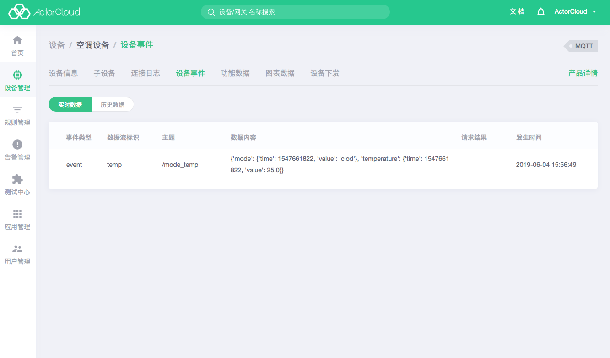
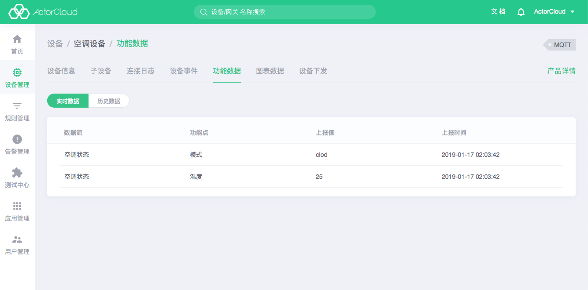

# 设备快速接入指南

设备快速接入指南将通过实例，指导开发者将 MQTT 协议设备快速接入 ActorCloud 平台，并完成模拟数据上报。


### 案例概述

本案例以空调上报温度和模式（制冷，制热）数据为例，帮助开发者快速接入 MQTT 协议设备。


### 接入步骤

#### 1. 新建产品

选择 设备管理->产品管理->新建，创建一个名为**空调**的产品，云端协议选择**MQTT**，产品类型选择**设备**，点击**完成**，添加产品成功。



新建产品详细操作请参考 [创建产品](/products/product_create.md)。

#### 2. 新建数据流

选择**功能定义**选项卡，点击右上角“新建”。

数据流名称填入**空调状态**，数据流标识填入**temp**，即为数据流的 ID，流类型选择**设备数据上报**，数据流主题填入**mode_temp**，备注可选填。


数据流详细介绍请参考 [数据流](/products/product.md#数据流)。

#### 3. 新建功能点

选择 设备管理-> 产品管理，产品列表页找到上一步创建的产品**空调**，点击名称，进入产品详情页面，选择**功能定义**选项卡，显示出一个数据流列表，点击刚才创建的数据流那一行顶部箭头，即可展开该行，显示一个子列表，也就是该数据流所绑定的功能点的列表。



创建一个功能点，点击子列表中的添加功能点，可以新建一个功能点直接绑定或从之前创建过的功能点列表中选择添加，这里就直接新建一个功能点，功能点名称就为**模式**，输入功能点标识（必填，不可重复，即为功能点的 ID）**mode**，数据类型选择**字符串**，数据传输类型选择**可上报可下发**，点击**确定**，新建功能点成功。



同样的方法，我们再创建一个功能点**温度**，输入功能点标识**temperature**，数据类型选择**数值**，数据传输类型选择**可上报可下发**，点击**确定**，新建功能点成功。



功能点详细介绍请参考 [功能点](/products/product.md#功能点)。

#### 4. 新建设备

在产品下，选择**设备管理**选项卡，新建一个名为**空调设备**的设备，所属产品选择的是第一步创建的产品**空调**，上联系统选择**云**，点击**下一步**，认证信息页面点击**完成**，添加设备成功。



新建设备详细操作请参考 [创建设备](/devices/device_create.md)。

#### 5. 模拟设备上报数据

选择 测试中心->MQTT 客户端，选择上一步创建好的设备**空调设备**，点击启动设备，以模拟设备接入 ActorCloud。


在**上报数据**选项卡里的主题中，输入上面创建的数据流主题**mode_temp**，根据初始模板输入 JSON 数据（制冷25度），点击**上报数据**，上报成功，右侧**已上报数据**选项卡可看到上报数据。

  ```json
  {
    "data_type": "event",
    "stream_id": "temp",
    "data": {
      "temperature": {
        "time": 1547661822,
        "value": 25
      },
      "mode": {
        "time": 1547661822,
        "value": "clod"
      }
    }
  }
  ```


MQTT 客户端详细操作请参考 [MQTT 客户端](/test_center/mqtt.md)。

#### 6. 查看设备上报数据

设备事件：进入设备管理，找到上面创建的设备**空调设备**，点击设备名称进入设备详情页，选择**设备事件**选项卡，可以看到刚刚上报的数据信息，可查看实时数据和历史数据。设备事件详细参考 [设备事件](/device/device.html#设备事件)。    

功能数据：选择**功能数据**选项卡，可以看到被解析出来的上报数据, 同样可以查看实时数据和历史数据。功能数据详细参考 [功能数据](/device/device.html#功能数据)。   
