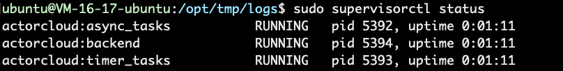

# 单节点部署

本指南介绍如何在单个 Linux 节点上部署 ActorCloud


### 安装

##### 基础组件安装

按照以下说明安装所需的基础组件

1. 下载并安装依赖以及常用程序

   ```bash
   # local utf-8 config
   $ export LANG="en_US.UTF-8" && export LC_ALL="en_US.UTF-8" && export LC_CTYPE=en_US.UTF-8
   
   $ sudo apt-get update
   
   $ sudo apt-get -y install wget gcc curl
   ```

2. Python3.6 安装

   ```bash
   $ sudo add-apt-repository -y ppa:jonathonf/python-3.6
   
   $ sudo apt-get update
   
   $ sudo apt-get install -y python3.6
   
   $ sudo apt-get install -y python3.6-dev
   ```

3. Pip 安装

   ```bash
   $ wget https://bootstrap.pypa.io/get-pip.py && python3.6 get-pip.py --force-reinstall --user
   ```

4. Pipenv 安装

   ```bash
   $ pip install --user pipenv
   ```

5. Supervisord 安装

   ```bash
   $ sudo apt-get install -y supervisor
   $ sudo systemctl enable supervisord
   ```

6. Node 安装

   ```bash
   $ curl -sL https://deb.nodesource.com/setup_10.x | sudo -E bash -
   $ sudo apt-get install -y nodejs
   ```

7. Yarn 安装

   ```bash
   $ curl -sS https://dl.yarnpkg.com/debian/pubkey.gpg | sudo apt-key add -
   
   $ echo "deb https://dl.yarnpkg.com/debian/ stable main" | sudo tee /etc/apt/sources.list.d/yarn.list
   
   $ sudo apt-get update && sudo apt-get install yarn
   ```

   

##### 第三方组件安装

1. [TimescaleDB 安装](timescaledb.md#TimescaleDB 安装)

2. [Pulsar 安装](pulsar.md#Pulsar 安装)

3. [EMQ X 安装](emqx.md#EMQ X 安装)

4. [Nginx 安装](nginx.md#Nginx 安装)

   


##### ActorCloud 安装

组件安装需要进入 ActorCloud 项目`server/`路径下执行

1. 获取 ActorCloud 

   ```bash
   $ git clone https://github.com/actorcloud/ActorCloud
   ```

2. 安装 ActorCloud 依赖

   依赖安装需要在ActorCloud 项目路径下执行

   ```bash
   # 后端依赖安装 server/下执行
   $ pipenv install
   # 前端依赖安装 ui/目录下执行
   $ yarn install
   ```


### 配置

##### 第三方组件配置

1. [TimescaleDB 配置](timescaledb.md#TimescaleDB 配置)
2. [Pulsar 配置](pulsar.md#Pulsar 配置)
3. [EMQ X 配置](emqx.md#EMQ X 配置)
4. [Nginx 配置](nginx.md#Nginx 配置)

##### ActorCloud 配置

配置需要进入 ActorCloud 项目路径下执行

自定义配置文件

```bash
$ cp server/config/config.yml server/instance/config.yml
# 修改配置
$ vi server/instance/config.yml
```

配置文件修改(参考备注修改)，以下配置部署前必须修改

* language: 系统语言
* log_path: ActorCloud 运行日志存放路径
* secret_key:  flask [SECRET_KEY](http://flask.pocoo.org/docs/1.0/config/#SECRET_KEY)
* admin_email, admin_password: 超级用户登录邮箱和密码
* site_name, site_domain, email_title:  用户邀请注册信息
* default_devices_limit: 是否限制租户所能创建的设备数, -1则不限制
* postgres: postgresql 配置信息
* emqx: emqx 配置信息
* mail: 邮件信息配置
* stream: pulsar配置信息


### 运行

##### ActorCloud 后端服务运行

ActorCloud 后端服务采用 [Supervisor](http://supervisord.org/) 运行, 以下操作需在 `server/` 目录下执行
1. 后端服务初始化

   ```bash
   $ pipenv run flask deploy
   ```
   
2. 拷贝 Supervisor 配置

   ```bash
   $ sudo cp server/deploy/production/supervisor/actorcloud.conf /etc/supervisor/conf.d/
   ```

3. 更新 Supervisor配置

   ```bash
   $ sudo supervisorctl update
   ```

4. 查看 ActorCloud 运行情况

   ```bash
   $ sudo supervisorctl status
   ```
   

5. 运行，暂停，重启 ActorCloud

   ```bash
   # 运行
   $ sudo supervisorctl start actorcloud:*
   # 暂停
   $ sudo supervisorctl stop actorcloud:*
   # 重启
   $ sudo supervisorctl restart actorcloud:*
   ```


##### ActorCloud 前端服务运行

ActorCloud 前端服务采用 [Nginx](https://www.nginx.com/) 运行, 以下操作需要在 `ui/` 目录下执行

1. 编译前端代码

   ```bash
   $ yarn build
   ```

2. 拷贝前端服务到 Nginx `www` 目录下

   ```bash
   cp -r ./dist/* www
   ```

3. 重启 Nginx 

   ```bash
   sudo service nginx restart
   ```

