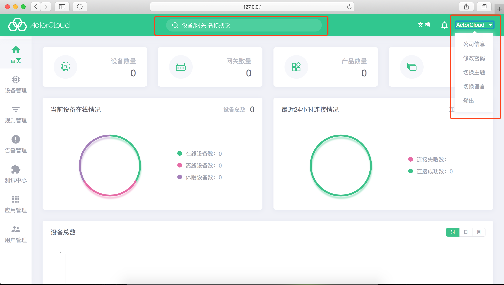

# ActorCloud 入门

### 注册 ActorCloud 账户

1. 打开 [ActorCloud 控制台主页](https://demo.actorcloud.io/)，如果之前未登陆过平台或者登录信息已过期将会跳转到登录页面；

2. 点击 [前去注册](https://demo.actorcloud.io/signup)，根据用户使用身份，完善注册信息，创建一个全新的账户；

3. 账户创建成功后跳转到登录页面，使用账户邮箱与密码即可登录系统；

4. 可使用 [用户邀请](/user/user.md#用户邀请) 功能直接将邀请链接发送到指定邮箱进行注册。

> 如果用户通过邀请链接进入注册页面，页面不再提供账户类型选择。

### 登录 ActorCloud 平台

- 使用已注册账号的邮箱和密码登录。

##### 个人用户与企业用户的区别

- 个人用户使用单个账号管理平台，该账号拥有平台全部操作权限，适合单人管理使用；

- 企业用户提供平台管理权限控制，可以直接创建或通过邮件邀请创建多个企业子账号、并赋予适当权限进行平台管理。

### 数据概览

点击左侧导航栏**首页**即可查看当前账户的概览信息，点击顶部**设备数量**、**网关数量**、**产品数量**、**分组数量**几个指标的数值可跳转到相关列表页查看数据。此外，该页提供多个维度的设备连接与消息数据统计：

- 当前设备在线情况：账户下设备在线、离线、休眠统计；
- 最近24小时连接情况：连接成功、失败统计；
- 设备总数：设备总数折线图统计；
- 消息数统计：设备登录、发布、接收、订阅、取消订阅次数折线图统计；
- 流量统计：设备登录、发布、接收、订阅、取消订阅流量折线图统计。

### 顶部菜单栏操作

#### 全局快速搜索

- 全局搜索框中输入名称可以快速搜索定位到响应的设备、网关。

#### 账户信息变更

- 点击右上角当前登录用户的用户名展开账户信息变更选项，点击**公司信息**可进行**公司信息**（公司账户）修改操作，可上传公司 Logo 强化品牌形象。

#### 修改密码

- 点击右上角当前登录用户的用户名展开账户信息变更选项，点击**修改密码**可进行**修改密码**操作。

#### 切换主题

- 平台管理界面提供浅色主题与深色主题，点击此处可以切换显示风格。

#### 切换语言

- 平台管理提供中文与英文，点击可快速切换语言。
