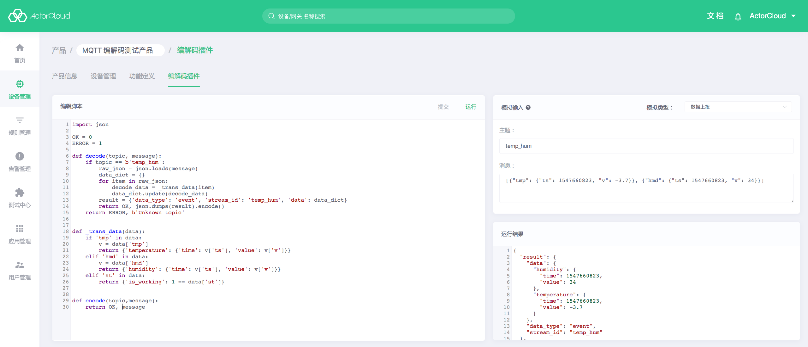

# ActorCloud 编解码插件使用说明

编解码插件用于 ActorCloud 与设备之间消息的编码和解码

## 一、功能定义

参考 [功能定义](product.md#功能定义)

## 二、编解码插件编写




### 编写脚本

以 `Python` 为语言编写脚本，运行环境为 `Python 3.6`。

参照数据格式规范，编写脚本代码。经测试可正确编解码后，将代码复制到编辑脚本输入框中。

#### 模拟输入说明

- 主题：消息 topic
- 消息：JSON 格式，如 `{"temp":17}`，`[{"temp":17},{"hmd":80}]`

ActorCloud 会对数据类型进行转换

### 运行

点击 `运行` 按钮，检查运行结果是否符合预期。

#### 运行结果说明

- error：脚本错误或者验证错误
- status_code：状态码
- result：处理以后的结果，以下会具体说明

##### 解码

1. `result` 为 JSON 字符串反序列化以后的结果
2. 解码结果的 `stream_id` 和 `data` 的字段必须和该产品功能定义的数据流和功能点相对应，否则验证不通过

返回格式如下：

```json
{
  "status_code": 0,
  "result": {
    "data_type": "event",
    "stream_id": "stream_id",
    "data": {
      "temperature": {
        "time": 1547660823,
        "value": -3.7
      },
      "humidity": {
        "time": 1547660823,
        "value": 34
      }
    }
  }
}
```

##### 编码

**特别说明**，考虑到编码会涉及到二进制数据，因此返回结果以字符串展示

返回格式如下：

```json
{
  "result": "b'\\x01\\x00\\x01\\x0c\\x0e\\xcc\\xc4'",
  "status_code": 0
}
```

**注意**

编解码脚本需要包含 decode 和 encode 两个函数，否则验证失败。如脚本中不需要某一函数，可直接返回

### 提交

返回结果没有 `error` 时，才能进行提交。点击 `提交` 按钮提交以后，需要管理员审核成功以后，才能正常使用。

### 审核

1. 登录超级管理员账户，进入：设备管理 -> 产品管理 -> 编解码插件审核，点击相应产品编解码插件的 `审核` 按钮

2. 审核结果中勾选 `通过` ，然后点击 `确定` 既可使该编解码插件生效


## 三、格式说明

`data_type` 和 `data` 必填

### 1. 消息上报

- data_type： `event`
- stream_id： 必填

`data` 格式为

```JSON
{
  "${field}": {
    "time": "${timestamp}",
    "value": "${value}"
  }
}
```

**非网关**

```json
{
  "data_type": "event",
  "stream_id": "stream_id",
  "data": {
    "act_th": {
      "time": 1547661822,
      "value": 100
    },
    "act_time": {
      "time": 1547661822,
      "value": 23
    }
  }
}
```

**网关**

- gateway：网关数据
- devices：网关下设备数据列表，其中 `device_id` 代表设备标识

```json
{
  "data_type": "event",
  "stream_id": "stream1",
  "data": {
    "gateway": {
      "status": {
        "time": 1547661822,
        "value": true
      }
    },
    "devices": [
      {
        "device_id": "device_id_1",
        "data": {
          "status": {
            "time": 1547661822,
            "value": true
          },
          "mode": {
            "time": 1547661822,
            "value": "cold"
          }
        }
      },
      {
        "device_id": "device_id_2",
        "data": {
          "status": {
            "time": 1547661822,
            "value": true
          },
          "mode": {
            "time": 1547661822,
            "value": "cold"
          }
        }
      }
    ]
  }
}
```

### 2. 请求

格式如下
```json
{
  "data_type": "request",
  "stream_id": "stream_id",
  "task_id": "d89ed1925a6d5c3184e1934244ad0000",
  "data": {
    "mode": "cold",
    "other_para": "test"
  }
}
```

- data_type：`request`
- stream_id：用于平台指令
- task_id：标识该次下发任务，用于 response
- data：下发内容，当选择自定义指令时，对应实际输入内容，若选择平台指令，则为:

  ```json
  {
    "${dataPointID}":"${value}",
  }
  ```

  例如，若选择温度功能点（temp），设置值为 22，则对应 data 为：

  ```json
  {
    "temp": 22
  }
  ```

### 3. 响应

适用于下发需要回复内容的情况

格式如下

```json
{
   "data_type": "response",
   "result": {
      "task_id": "llasdah182anksjd",
      "code": 0
   },
   "data": {
      "mode": {
         "time": 1547661822,
         "value": "cold"
      },
      "other": {
         "time": 1547661822,
         "value": "xxxx"
      }
   }
}
```

- data_type：`response`
- result.task_id：对应下发的 task_id
- result.code：状态码，`0`：成功，`1`：失败
- data：响应内容。无响应内容时，可为空对象{}


## 四、编解码函数说明

### 1. 编码函数说明

将 ActorCloud 消息编码为设备所需格式

  ```python
  def encode(topic, message):
      ...
      return status_code, result
  ```

参数说明

- topic：`bytes` 类型，消息 topic
- message：`bytes` 类型，消息 payload

返回说明

- status_code：`int` 类型，状态码，`0`：成功，`1`：失败
- result：`bytes` 类型，编码结果

**示例**

```python
import json


OK = 0
ERROR = 1


def encode(topic, message):
    status_code = ERROR
    if topic == b'/19/1/0':
        raw_json = json.loads(message)
        data = raw_json.get('data')
        if data.get('lock') == 0:
            # unlock command
            status_code = OK
            result = b'\x01\x00\x01\x0c\x0e\xcc\xc4'
        elif data.get('lock') == 1:
            # lock command
            status_code = OK
            result = b'\x01\x00\x01\x0c\x0f\x0d\x04'
        else:
            result = b'Unknown command'
    else:
        result = b'Unknown topic'
    return status_code, result


if __name__ == '__main__':
    # mock data
    message = {
        'data_type': 'request',
        'stream_id': "stream_id",
        'task_id': 'd89ed1925a6d5c3184e1934244ad0000',
        'data': {
            'lock': 0
        }
    }

    encode_result = encode(b'/19/1/0', json.dumps(message).encode())
    print(encode_result)

```

编码结果

```bash
(0, b'\x01\x00\x01\x0c\x0e\xcc\xc4')
```

### 2. 解码函数说明

将设备上报消息解析为 ActorCloud 定义的标准格式

```python
def decode(topic, message):
    ...
    return status_code, result
```

参数说明

- topic：`bytes` 类型，消息 topic
- message：`bytes` 类型，消息 payload

返回说明

- status_code：`int` 类型，状态码，`0`：成功，`1`：失败
- result：`bytes` 类型，解码结果，JSON 格式

**示例**

```python
import json

OK = 0
ERROR = 1

def decode(topic, message):
    if topic == b'/19/0/0':
        raw_json = json.loads(message)
        data_dict = {}
        for item in raw_json:
            decode_data = _trans_data(item)
            data_dict.update(decode_data)
        result = {'data_type': 'event', 'stream_id': 'stream_id', 'data': data_dict}
        return OK, json.dumps(result).encode()
    return ERROR, b'Unknown topic'


def _trans_data(data):
    if 'temp' in data:
        v = data['temp']
        return {'temperature': {'time': v['ts'], 'value': v['v']}}
    elif 'hmd' in data:
        v = data['hmd']
        return {'humidity': {'time': v['ts'], 'value': v['v']}}
    elif 'st' in data:
        return {'is_working': 1 == data['st']}
   
if __name__ == '__main__':
    message = b'[{"temp": {"ts": 1547660823, "v": -3.7}}, {"hmd": {"ts": 1547660823, "v": 34}}]'
    decode_result = decode(b'/19/0/0', message)
    print(decode_result)
```

解码结果：

```bash
(0, b'{"data_type": "events", "stream_id": 235, "data": {"temperature": {"time": 1547660823, "value": -3.7}, "humidity": {"time": 1547660823, "value": 34}}}')
```