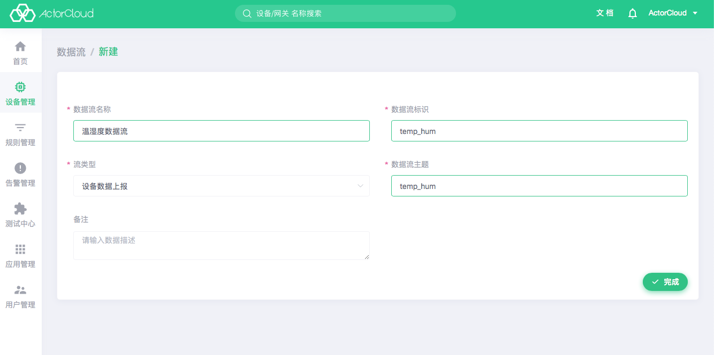

# 产品管理

产品为设备的一个抽象集合，设备为产品的一个具体实例，一个设备必须对应唯一一个产品，不能直接删除设备非空的产品。

进入设备管理->产品管理，可查看产品列表：

- 点击**设备数量**查看产品下设备列表；

- 点击**数据流**或**功能点**查看功能定义；

- 点击右上角的**新建**按钮可进行产品新建操作，请按照产品接入协议选择相应的**云端协议**。或选择对应的产品类型，可以选择**设备**或**网关**，若选择网关类型后还需要选择相应的**网关协议**。

点击产品卡片查看产品详情，产品详情有**产品信息**、**设备管理**、**功能定义**、**编解码插件**等几个基础模块。不同产品根据接入协议显示功能模块有所区别。

### 产品信息

查看当前产品的基础信息，可编辑产品的产品名称和产品描述。

### 设备列表

显示当前产品下的设备列表，操作同 **设备管理** -> **设备列表**。

### 功能定义

功能定义包含数据流和功能点，一个产品可以有多个数据流，数据流下又可以绑定多个功能点。

#### 数据流

数据流为产品/设备能够产生或消费的业务信息报文。
一条数据流包含一个或多个功能点，一个产品可以定义多个数据流，但是同一产品下的数据流主题不能重复，点击产品详情页中的功能定义即可查看该产品数据流列表。

数据流定义关键信息如下：

- 数据流标识：用于标识该数据流的 ID；

- 流类型：可选设备数据上报、设备数据下发，数据的方向；

- 数据流主题：数据流用于通信的主题；

定义示例：

- 温湿度传感器需要上报温度与湿度信息，则数据流名称可以为温湿度数据流，主题为 `temp_hum`：



#### 功能点

功能点为产品/设备具备的最细粒度的能力或用途，一个产品可以包含多个功能点，需要绑定到数据流下，点击产品详情页中的功能定义，展开每一行数据流下的子列表，即可查看该数据流下的功能点列表。在点击添加功能点后，选择已有功能点的选项卡页面，即可查看该产品下所有的功能点。

功能点定义关键信息如下：

- 功能点标识：该功能数据在传输中使用的 JSON key 值；

- 数据传输类型：根据实际应用，选择只上报、只下发或可上报可下发

- 数据类型：根据实际上报/下发数据定义；

| 类型标识 | 名称        | 转换后类型
| --- | --------- | ------- |
|  1  | 数值       | Float  |
|  2  | 字符串     | String  |
|  3  | 布尔       | Boolean |
|  4  | 时间       | String  |
|  5  | 地理位置   | String   |

- 枚举

 某些功能点不同数值如开关状态、噪声等级等有特定的含义，可以枚举出来，这类功能点可以添加枚举选项。

  - 实际值：实际上报、下发的值；

  - 显示值：显示在 ActorCloud 界面上的值。

定义示例：

- 某温度传感器需要定时上报温度信息，其上报 JSON 数据如下，`temperature` 即为功能点标识：

```json
{
  "data_type": "event",
  "stream_id": "temp_hum",
  "data": {
    "temperature": {
      "time": 1547661822,
      "value": 77
    },
  }
}
```

该功能可按照下图定义：


