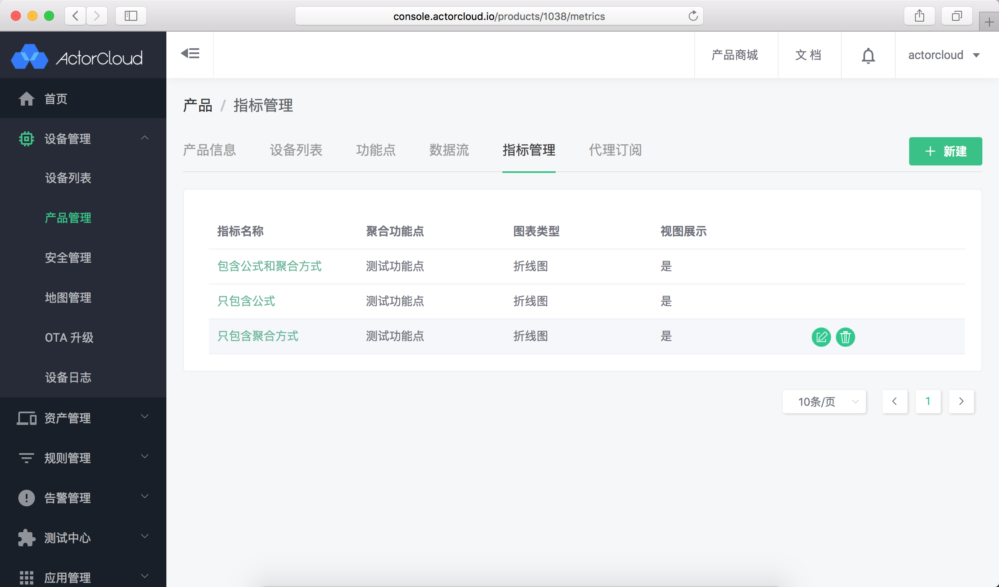
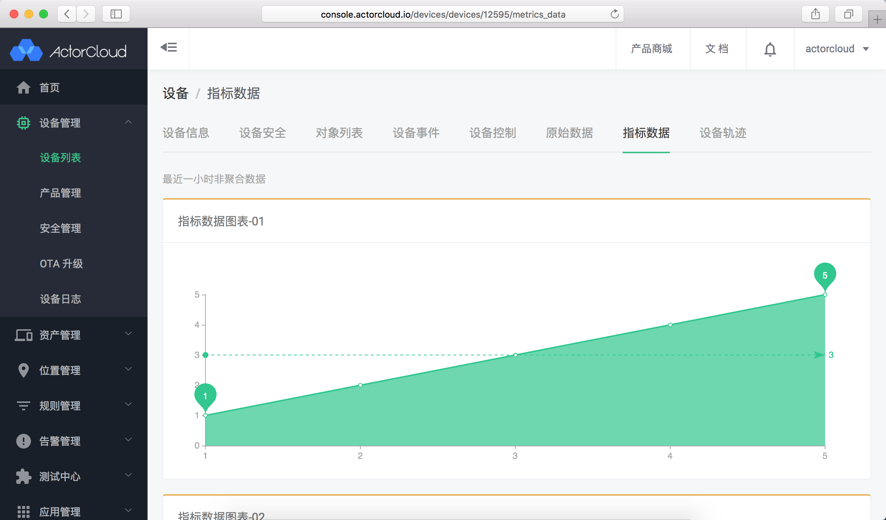
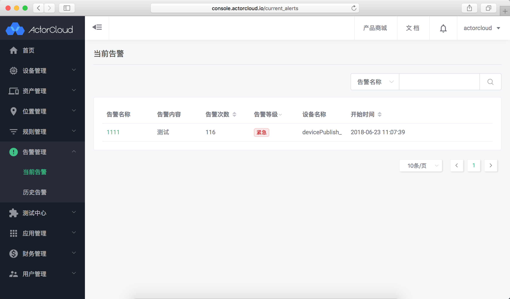
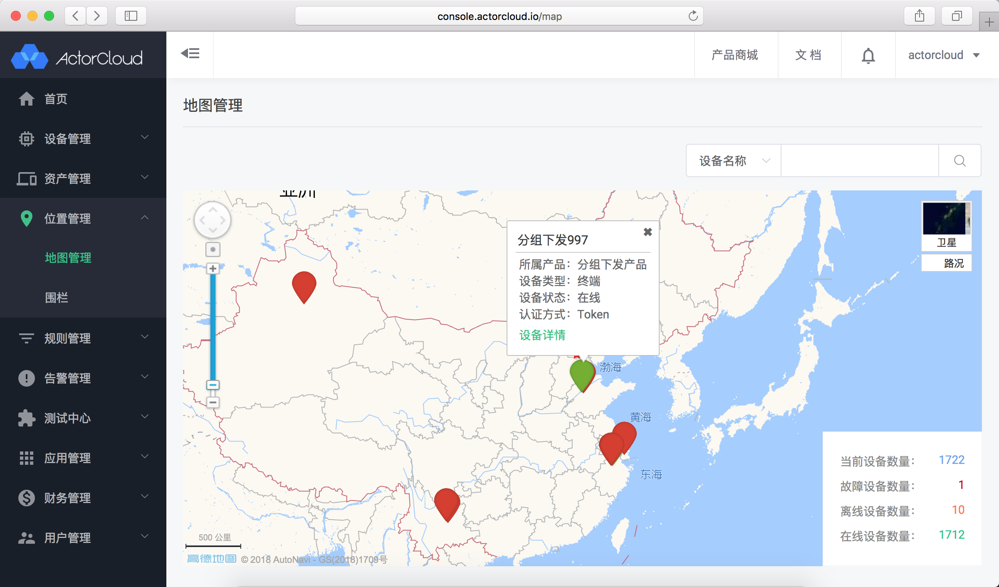
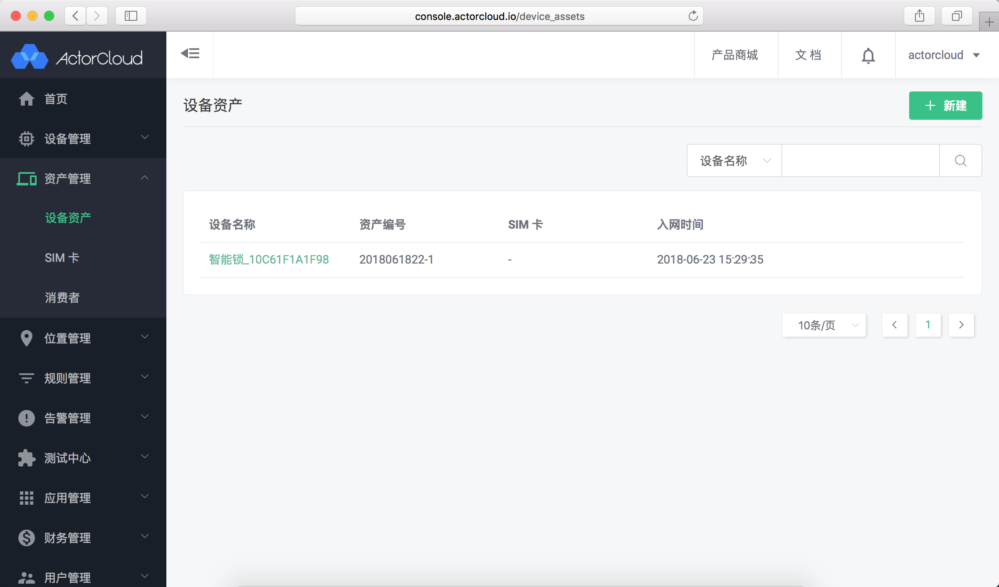
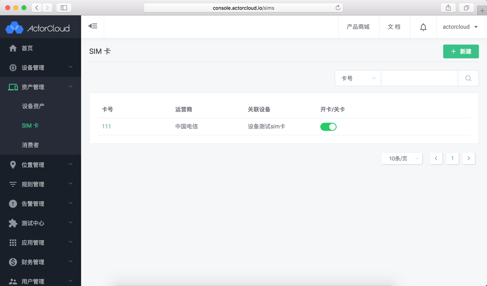
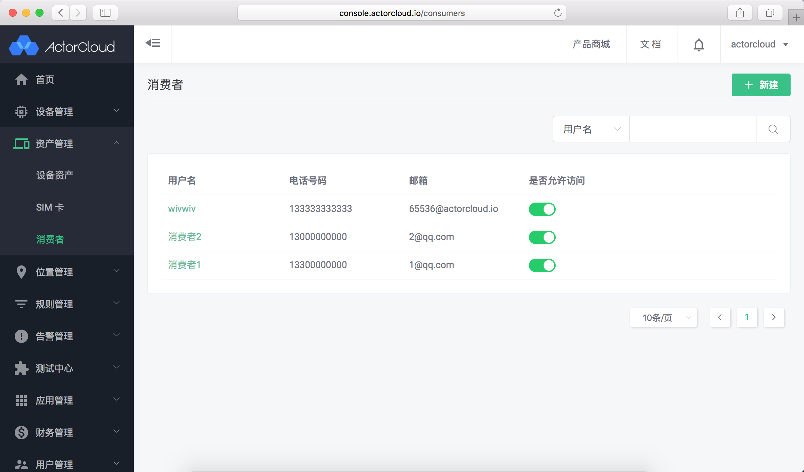
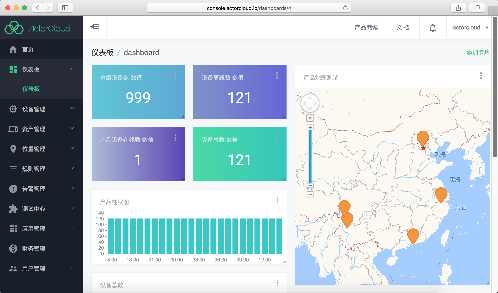
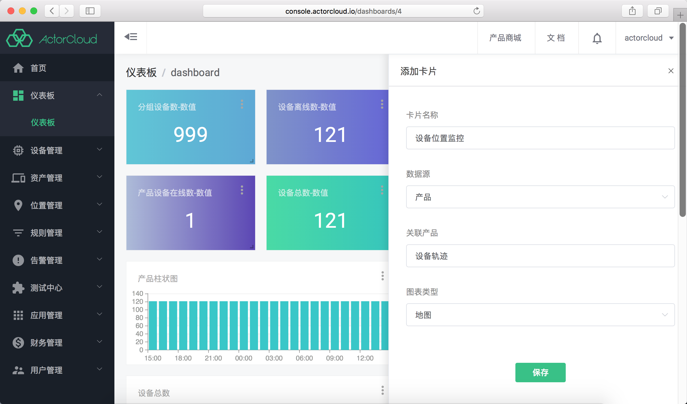

# 设备管理平台 DMP

设备管理平台 DMP 包含高级的产品与设备管理服务，可支持数据聚合、监控告警、位置与轨迹地图展示、设备资产与消费者管理等进阶服务。

#### 产品开发

产品下功能点、数据流、数据指标管理，使用说明详见[产品文档](../device/product.md)。

- 指标管理

- 指标数据图表展示

#### 告警管理

通过业务规则匹配设备数据提供实时监控告警服务，使用说明详见[告警管理](../alert/alert.md)。

- 当前告警

#### 位置管理

提供设备位置、围栏规则、设备轨迹等位置管理相关服务，使用说明详见[位置管理](../location/location.md)。

位置管理服务支持将设备位置在地图上标注显示，支持按照设备名称、设备编号、所属产品、所属分组、认证方式等进行精确/模糊搜索展示与设备围栏展示管理。

- 地图管理

#### 资产管理

设备资产、SIM 卡与消费者管理服务，使用说明详见[资产管理](/assets_manage/device_assets.md)。

资产管理用于设备资产、设备与 SIM 卡绑定管理、消费者与设备关联管理。

- 设备资产

- SIM 卡

- 消费者

#### 仪表盘

数据可视化增强服务，支持各类数据、多种形式的图表、地图等定义与展示，使用说明详见[仪表盘](../data_visualization/dashboard.md)。

- 数据展示

- 数据编辑

