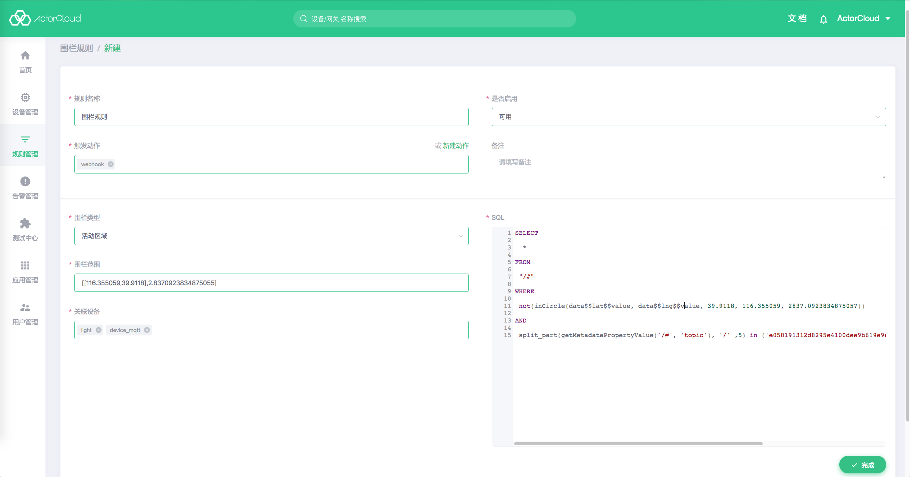

# 业务规则

业务规则应用于每一条设备上报至平台的数据流，通过预定义数据的相关规则与关联触发动作，当数据流里的数据满足规则定义时即可触发相应的动作。

依次点击左侧导航栏**规则管理** -> **业务规则**可进行业务规则与动作的管理。


创建业务规则前，需要预先定义[功能点](/device/product.md#功能点)与[数据流](/device/product.md#数据流)。

除必要的名称与备注信息外，业务规则还应当包含以下几个部分：

- 关联产品：该条业务规则应用的产品，与关联分组互斥；

- 关联分组：该条业务规则应用的分组，与关联产品互斥；

- 关联设备：可选选项，标识仅应用针对某个具体设备；

- 关联数据流：业务规则将应用于该数据流，若是规则条件成立，将触发相应动作；

- 触发动作：当数据流满足定义时触发的动作，可多选；

- 频率：数据流满足条件时触发动作的频率，包含选项如下：

  - 每次满足条件都触发：一旦数据流满足条件，立即触发动作产生，数据流较密集时将触发多次动作；

  - 满足频率时触发：当数据流多长时间内满足条件多少次时触发动作；

  - 条件持久存在时触发：当数据流满足条件持续若干分钟/小时后触发动作。

- 条件类型：
  - 功能点：比较上报数据流中的某个功能点（特定字段）；
  - 公式指标：比较上报数据流经过公式指标转换后的值字段值；
  - 未上报数据：消息内容为空时（空对象、空数组）时直接触发。

- 条件：对数据流里的数据校验规则，一个条件包含以下要素：
  - 功能点：该条件校验的功能点，ActorCloud 将使用该功能点的数值进行条件匹配；
  - 运算符：功能点中的数值与比较对象的比较规则，包含**大于**、**大于等于**、**小于**、**小于等于**、**等于**、**不等于**六个比较规则；
  - 比较对象：可选静态值与该数据流下另一个功能点，选择静态值时需手动输入要比较的静态值；
  - 条件间关系：一个规则有多个条件时可选该项，表示条件与条件之间的运算关系。





# 动作

动作是数据流里的数据满足规则时触发的事件，动作定义关键信息如下：

- 动作名称：该动作的名称；

- 动作类型：触发动作的方式，包含选项如下：

  - 告警：以不同告警级别将动作记录到平台[告警管理](/alert/alert.md)中，包含有告警标题与告警内容；

  - 邮件：发送告警邮件到指定邮箱，可以使用逗号分隔输入多个邮箱，需要填写通知标题与通知内容；

  - Webhook：将动作推送到指定 URL 地址，创建前必须通过验证，请参考验证流程进行配置。

- 描述：该动作的描述信息。


**附：Webhook 验证流程**

**ActorCloud** 根据填入的 URL 地址与 token 进行认证，服务器将发送 GET 请求到填写的服务器地址 URL 上，请求携带参数如下:
- timestamp 时间戳；
- nonce 随机数；
- signature 加密签名，signature 为 token、 timestamp、nonce 变量值拼接并进行 sha1 加密后的值。。

请求地址为：`{{url}}?signature=xxx&?timestamp=yyy&nonce=zzz`

Webhook 接口收到请求后，需要进行校验，校验规则如下：

- 按 token、timestamp、nonce 顺序，将三个变量的值拼接为一个字符串，并用 sha1 进行加密；
- 将加密后的字符串与请求中的 signature 字符串对比。

若相等则验证通过，直接以 JSON 格式返回 nonce 随机数：

```json
{
  "nonce": "zzz"
}
```
