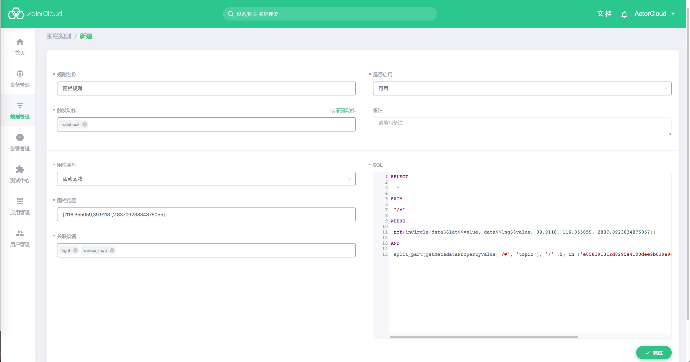

# 围栏规则

围栏规则主要用于地理信息，可以为设备设置一个围栏，设定为活动区域或者禁止区域，当设备超出活动区域或者进入禁止区域时，触发规则。

一般来说，围栏规则 SQL 通过用户选择以后自动生成，若用户有需要，可以进行修改。围栏规则主要包含三个部分。

**1. 围栏类型**

- 活动区域
-  禁止区域

**2. 围栏范围**

通过在地图上选择围栏范围，支持圆形围栏和多边形围栏

**3. 关联设备**

选择围栏规则应用的设备，可多选



SQL 样例

```sql
SELECT split_part(getMetadataPropertyValue('/+/CcSMji6gp/#', 'topic'), '/' , 5) AS device_id
FROM "/+/CcSMji6gp/#"
WHERE inCircle(data$$lat, data$$lng, 39.917739, 116.357634, 2083.487794747287)
    AND device_id in ('client_id_5000','client_id_50001')
```

**函数说明**

```
String split_part(String text, String delimiter, int position)
```
参数说明
- text：待分割的字符串
- delimiter：分隔符
- position：位置，从 1 开始

该函数返回分割以后的特定位置的字符串

